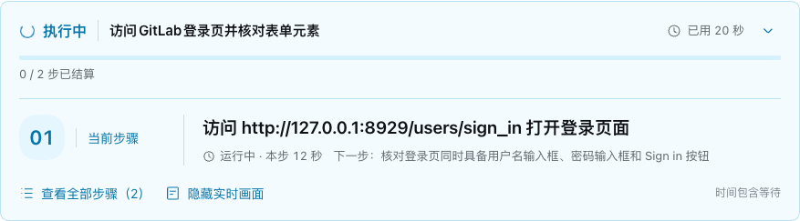
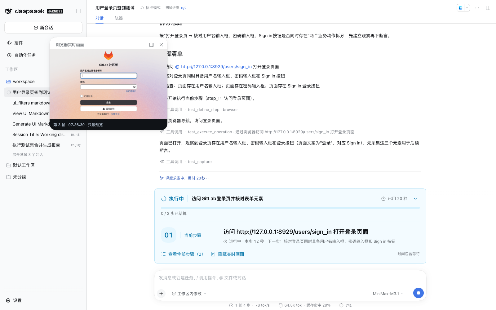
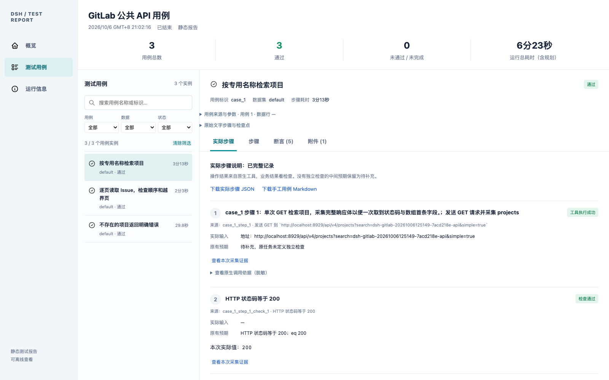

# DSH Test Plugin

**Plan and execute tests, capture evidence, and generate reports inside a DeepSeek Harness conversation.**

[简体中文](README.md) · English

[Version v0.11.2](https://github.com/Pegasus-Yang/DSH-Test-Plugin/tree/v0.11.2) · [Changelog (Chinese)](changelog.md) · [MIT License](LICENSE) · [Documentation](doc/README.md) · [Issues](https://github.com/Pegasus-Yang/DSH-Test-Plugin/issues)

DSH Test Plugin is a native TypeScript plugin for DeepSeek Harness (DSH), supporting browser tests and HTTP GET JSON checks. It uses the current conversation's model, tools, approvals, and persistence, evaluates assertions against captured observations and sourced expectations, and produces static HTML reports.

Describe a test in the DSH input:

```text
/test Visit http://127.0.0.1:8929/users/sign_in and verify that the page has a username field, a password field, and a Sign in button.
```

This check uses an available GitLab login page and needs no account. For GitLab deployment and startup, follow the [official Docker documentation](https://docs.gitlab.com/install/docker/). See the [test requirements and local debugging guide (Chinese)](doc/user-guide/GitLab测试要求与本地调试.md) for system conditions, account permissions, and plugin usage. The plugin presents a text plan, executes each step with progress updates, and returns the result and report link. Use `/test-plan` to review the plan before execution.

> This development release targets DSH `0.2.1-alpha.1`. Git releases include built artifacts and can be installed directly. Website content and model execution can change; recorded observations, assertions, and cleanup status determine the final result.

## Features

| Feature | Description |
| --- | --- |
| Natural-language plans | Split tasks into business actions and textual checks; review or revise plans through native approval |
| Browser and API tests | Operate a dedicated Playwright MCP browser; capture GET JSON responses and check status codes or fields |
| Actual steps and manual cases | Record operation explanations and real inputs during execution; per-instance numbering, manual Markdown and run-record downloads, with failures and retries retained |
| Evidence-based assertions | Preserve actual observations, expectations, and their sources; compute results deterministically |
| Files and parameters | Import TXT or Markdown cases; expand CSV data and review before running |
| Execution progress | Show the current step, settled count, and elapsed time; expand the bounded list for long text and continuous batch numbering |
| Live browser preview | Display headless browser frames through Browscreen after the current page has usable CDP and a valid first frame |
| Browser recordings | Independent toggle, off by default; per-instance MP4 playback, seeking and download; no media UI for API instances |
| Reports and cleanup | Static HTML reports with steps, assertions, and attachments; stop, cleanup, and environment recovery |

Version 0.11.2 presents TXT, Markdown, and CSV parameters as user inputs, with readable GitLab browser and API cases. Manual cases retain real inputs and URLs; results, failures, and evidence stay in the report. See the [actual-step guide (Chinese)](doc/user-guide/实际步骤与手工用例.md), [changelog (Chinese)](changelog.md), and [GitLab examples (Chinese)](doc/user-guide/GitLab复杂用例.md).

## Screenshots

These screenshots show **real GitLab runs on version 0.11.2**, using the Chinese UI: a login-page control check for progress and live preview, and Markdown API cases for reports and actual steps. See the [acceptance record (Chinese)](doc/project/Markdown用户入口验收.md) for complex UI validation boundaries. Generated steps and timings can vary.

**See the current step and elapsed time.** The progress area shows the current action, settled count, total duration, and step duration. Expand the full list when needed.



**Watch the execution and browser in the same conversation.** A floating window displays live frames from the headless browser after the current page has usable CDP and a valid first frame. Move, resize, or close it through the host UI. This full-page screenshot shows the preview, conversation records, and step progress together.



**Compare actual values with expectations.** The static report organizes cases, steps, assertions, and evidence for GitLab project search, pagination, and expected error responses.



See the [illustrated user guide](doc/user-guide/使用说明.en.md) for plan review, full steps, preview settings, and assertion details.

## Quick start

### 1. Prerequisites

- Node.js **22.19+** and pnpm **11.7.0**.
- An installed DeepSeek Harness **0.2.1-alpha.1** with a working model configuration, using either the standalone CLI or a source installation.
- Browser tests require a dedicated Playwright MCP and Chromium; API-only tests can skip browser installation.

Install the host according to its own documentation. Revalidate compatibility after changing the host or MCP version.

### 2. Install from GitHub

Enter this repository URL in the DSH plugin manager, install it, and enable the plugin:

```text
https://github.com/Pegasus-Yang/DSH-Test-Plugin.git#v0.11.2
```

Alternatively, run from the DSH source checkout:

```sh
pnpm dsh plugin --profile web add github:Pegasus-Yang/DSH-Test-Plugin#v0.11.2
pnpm dsh web
```

For a standalone CLI use `dsh plugin --profile web add github:Pegasus-Yang/DSH-Test-Plugin#v0.11.2` and `dsh web`. Stop an existing host before CLI installation and restart the same profile afterwards. Use the same `DSH_HOME` for installation and startup.

Git releases include `dist` and execute no plugin build scripts at installation. No source clone, `link-host`, or local debugging files are required. Configure native tools and a dedicated Playwright MCP using the [deployment guide](doc/deployment/安装与运维.en.md#configure-the-installed-plugin).

### 3. Uninstall or develop from source

Disable or remove the plugin in the plugin manager. For CLI removal, stop the host first:

```sh
pnpm dsh plugin --profile web remove dsh-test-plugin
```

Version 0.9.1 changes only MCP runtime parameters for automatic preview. Disabling restores the original browser configuration; restarting after removal leaves no plugin-file reference. Workspace reports and saved preferences remain. Earlier persistent preview overrides need the [one-time recovery steps](doc/deployment/常见问题速查与处理.md#f15-卸载后的预览配置残留).

To edit source or create a local archive:

```sh
git clone https://github.com/Pegasus-Yang/DSH-Test-Plugin.git
cd DSH-Test-Plugin
pnpm install
pnpm build
pnpm pack --out artifacts/package/dsh-test-plugin.tgz
```

Development dependencies use the public npm DSH SDK. `node scripts/link-host.mjs /absolute/path/deepseek-harness` is optional for unpublished host changes. Rebuild and commit `dist` after source changes; CI checks that the artifacts match.

For browser tests, also run from the plugin root:

```sh
node scripts/install-browser.mjs
```

Local archives can also be installed through the public CLI:

```sh
pnpm dsh plugin --profile web add /absolute/path/DSH-Test-Plugin/artifacts/package/dsh-test-plugin.tgz
```

Keep local archives because they remain `file:` dependency sources. For same-path updates finish removal and installation before restarting; see the [deployment guide](doc/deployment/安装与运维.en.md).

### 4. Run tests in a conversation

Enter these commands in the **DSH input**, not a terminal. Run them separately:

```text
/test-plan Visit http://127.0.0.1:8929/users/sign_in and verify that the page has a username field, a password field, and a Sign in button.
/test-run .local/gitlab/<run-marker>/api.md
/test-data .local/gitlab/<run-marker>/pagination.csv --file examples/gitlab/pagination-parameterized.md
```

For the last two commands, prepare GitLab data, replace `<run-marker>` with the generated directory, and fill the CSV's current API project ID using the [test guide (Chinese)](doc/user-guide/GitLab测试要求与本地调试.md). Do not run unresolved public templates. File paths resolve against the invoking conversation's workspace. Using the plugin source root keeps both private generated cases and public templates within that boundary. Older sessions without a working directory fall back to the configured plugin `workspace`. The included cases are Chinese; English descriptions use the same format. See the [user guide](doc/user-guide/使用说明.en.md) for approval and parameter rules.

## Live browser preview and recording

Version 0.11.2 includes independent recording and report playback. Install the GitHub tag above; remove an older plugin installation first, install the new tag, then restart the same profile.

Install `browscreen[video]==0.3.0` from PyPI on the DSH host first (Python ≥3.14; stable versions `>=0.3.0,<0.4.0`). In **Settings → 测试插件 → 浏览器预览与录像**, enable preview, click 检测安装, select the capture port and dedicated Playwright MCP, and save. The command defaults to `browscreen`; advanced settings accept its absolute executable path. No source checkout or separate service startup is required.

Enable 录制浏览器操作视频 to record independently of preview. The default is off. Closing the floating window or DSH page does not stop server-side recording; keep the host running. Each browser instance archives its own MP4 and offers an 操作录像 tab with playback, seeking, and download. API-only and mixed-suite API instances show no media area. Missing video dependencies produce an installation hint; see the [recording guide (Chinese)](doc/user-guide/浏览器录像与报告.md).

The floating preview waits for the current page's CDP and a valid first frame. API-only tests and unavailable browser frames show no empty preview. Follow the [step-by-step setup guide (Chinese)](doc/user-guide/浏览器实时预览一步一步配置.md) for dependencies and editable MCP registration.

## Commands and reports

These commands and UI actions describe version 0.11.2; see the [changelog](changelog.md) for earlier versions.

| Command | Purpose |
| --- | --- |
| `/test <task>` | Present the plan and run immediately |
| `/test-plan <task>` | Review the plan before running |
| `/test-run <file>` | Run TXT or Markdown cases |
| `/test-data <CSV> --file <cases>` | Expand parameters, review, and execute |

Only the four commands above remain. Use the native DSH Stop button to stop a run. The preview button switches between 显示实时画面 (show) and 隐藏实时画面 (hide), with at most one preview window per conversation.

Steps and elapsed time appear above the composer. After a run ends, click 重建报告 (Rebuild report) in the dock or details. Historical runs can be rebuilt from Settings → 测试插件 → 测试报告 using an explicit run ID; leave the field blank for the selected conversation. The final response includes a report link and save location. Reports are static HTML, available through DSH authentication or offline with the run directory. [Progress guide (Chinese)](doc/user-guide/执行步骤与进度显示.md) · [User guide](doc/user-guide/使用说明.en.md) · [Troubleshooting (Chinese)](doc/deployment/常见问题速查与处理.md)

If the environment is quarantined, open **Settings → 测试插件 → 测试环境**, confirm old external operations have stopped, follow recovery instructions, and resubmit the case. If automatic browser closing is unavailable, submit your workspace evidence JSON using 高级处置：提交实际处置证据 on the same settings page. See the [recovery guide (Chinese)](doc/user-guide/测试环境卡住怎么办.md).

## Current scope

- DSH native tool mode only; shared environments run serially. Independent browsers across concurrent conversations are a [planned improvement (Chinese)](doc/design/多对话并行测试优化方案.md).
- Trusted API capture supports **GET JSON**. Automatic preview uses a local Chromium Playwright MCP and currently supports one active page.
- File-based execution still uses the model loop. Model-free report reconstruction does not provide model-free test replay.
- Reports and some command messages remain primarily Chinese. Cancellation, missing evidence, tool errors, and required cleanup failures do not count as passing.

## Development and contributing

The [GitLab test requirements and local debugging guide (Chinese)](doc/user-guide/GitLab测试要求与本地调试.md) covers system conditions, account permissions, DSH/MCP configuration, five Markdown cases, CSV parameters, preview, recordings, reports, and per-run project cleanup. The two UI cases cover filtering and draft cancellation; three API cases cover search, pagination, and errors. See the [scenario table](examples/gitlab/README.md) and the separate [developer regression guide (Chinese)](doc/reference/开发者JSON用例与调试.md).

After installing dependencies, run from the plugin root; host linking is optional for unpublished host changes:

```sh
pnpm typecheck
pnpm build
pnpm test:unit
pnpm test:integration
```

See [isolated development](doc/deployment/安装与运维.en.md#isolated-development-environment) for the local host and real acceptance workflow. When reporting issues, include plugin, DSH, Node.js, and MCP versions, reproduction steps, and sanitized error details. Validate relevant changes and update affected documentation before submitting them.

Keep local credentials, authenticated URLs, logs, unredacted screenshots, and raw run reports under `.local/` or `artifacts/`, outside public commits. Store checked public documentation screenshots in `doc/user-guide/images/` and reference them with relative paths. Create annotated version tags using the [release guide (Chinese)](doc/deployment/版本发布与Git标签.md).

## Documentation

| Document | Contents |
| --- | --- |
| [Documentation index](doc/README.md) | English entry points, deployment, design, and historical acceptance records |
| [User guide](doc/user-guide/使用说明.en.md) | Commands, inputs, parameters, assertions, and reports |
| [GitLab test requirements and local debugging (Chinese)](doc/user-guide/GitLab测试要求与本地调试.md) | System conditions, account permissions, complex cases, plugin features, and source debugging |
| [Deployment guide](doc/deployment/安装与运维.en.md) | Build, install, configure, update, and run an isolated host |
| [Troubleshooting (Chinese)](doc/deployment/常见问题速查与处理.md) | Environment, preview, installation, and report problems |
| [Architecture (Chinese)](doc/architecture/当前实现.md) | Module responsibilities and execution flow |
| [Development record (Chinese)](doc/project/开发进度.md) | Validation scope and historical findings |

## License

Licensed under [MIT](LICENSE). Third-party dependencies and icon licenses are documented in [THIRD_PARTY_NOTICES.md](THIRD_PARTY_NOTICES.md).
