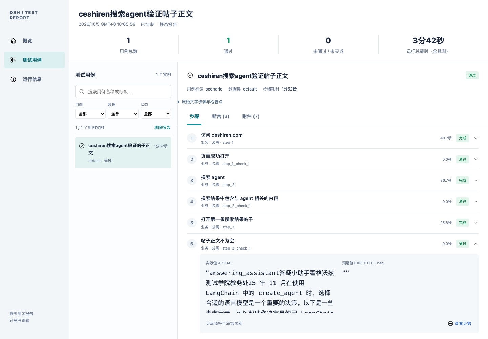

# DSH Test Plugin

**在 DeepSeek Harness 对话中，用自然语言完成测试规划、执行、证据采集和报告。**

简体中文 · [English](README.en.md)

[版本 v0.9.1](https://github.com/Pegasus-Yang/DSH-Test-Plugin/tree/v0.9.1) · [更新日志](changelog.md) · [MIT 许可证](LICENSE) · [文档](doc/README.md) · [问题反馈](https://github.com/Pegasus-Yang/DSH-Test-Plugin/issues)

DSH Test Plugin 是 DeepSeek Harness（DSH）的原生 TypeScript 插件，支持网页和 GET JSON 接口测试。它复用当前对话的模型、工具、审批及会话记录，通过可信观察与确定性比较给出断言结果，并生成可离线查看的 HTML 报告。

在 DSH 输入框中描述一条测试：

```text
/test 访问ceshiren.com，搜索 agent，打开第一条搜索结果帖子，断言帖子的点赞数不为0
```

插件会展示文字计划，逐步执行、更新进度，最后给出测试结果和报告链接。需要先确认计划时，将 `/test` 改为 `/test-plan`。

> 当前为开发版本，适配 DSH `0.2.1-alpha.1`。从下方 GitHub 地址安装即可，发行版本包含构建产物。网页内容和模型执行可能变化，最终结果以报告中的观察、断言及清理状态为准。

## 功能

| 功能 | 说明 |
| --- | --- |
| 自然语言规划 | 将任务拆成业务步骤和文字检查点；支持原生计划审核与修改 |
| 网页与接口测试 | 通过专用 Playwright MCP 操作网页；采集 GET JSON 响应并校验状态码和字段 |
| 可信断言 | 记录实际观察、预期及来源，用确定性比较判断结果 |
| 文件与参数化 | 导入 TXT、Markdown、JSON 用例；CSV 数据展开后先审核再执行 |
| 执行进度 | 天蓝色当前步骤面板，展示结算数量和耗时；完整列表按需展开，支持长文字和多实例编号 |
| 浏览器实时画面 | 通过 Browscreen 显示无头浏览器画面；仅在当前页面 CDP 和有效首帧就绪后打开浮窗 |
| 报告与收尾 | 静态 HTML 报告包含步骤、断言及附件；支持停止、资源清理和隔离环境处置 |

## 实际效果

以下截图来自 **0.9.1 的真实运行**，示例任务是访问 ceshiren.com、搜索 `agent`、打开第一条结果并检查帖子正文不为空。网页内容、步骤拆分和耗时会随实际运行变化。

**正在做哪一步，一眼就能看到。** 天蓝色面板显示当前操作、已结算数量、总耗时和本步用时；完整步骤可以按需展开。


**浏览器无头运行，也能看到页面。** 当前页面 CDP 和有效首帧就绪后，浮窗自动展示实时画面；窗口可以移动、缩放和关闭。


**结果有实际值、预期和证据。** 报告按用例、步骤、断言及附件组织，能够核对“正文不为空”的实际比较结果，也可离线查看。



计划审核、完整步骤、预览设置和断言细节的截图见[使用说明](doc/user-guide/使用说明.md#用截图认识功能)。

## 快速开始

### 1. 准备环境

- Node.js **22.19+**，pnpm **11.7.0**。
- 已安装并配置可用模型的 DeepSeek Harness **0.2.1-alpha.1**，独立 CLI 或源码安装均可。
- 网页测试需要专用 Playwright MCP 和 Chromium；仅做接口测试可跳过浏览器安装。

宿主安装先按 DSH 自身文档完成。更换宿主或 MCP 版本后需要重新验证兼容性。

### 2. 从 GitHub 安装并启用

在 DSH 插件管理页填写下面的仓库地址，安装后启用插件：

```text
https://github.com/Pegasus-Yang/DSH-Test-Plugin.git#v0.9.1
```

也可以在 **DSH 源码目录** 使用终端安装：

```sh
pnpm dsh plugin --profile web add github:Pegasus-Yang/DSH-Test-Plugin#v0.9.1
pnpm dsh web
```

已有独立 CLI 时，使用 `dsh plugin --profile web add github:Pegasus-Yang/DSH-Test-Plugin#v0.9.1` 和 `dsh web`。CLI 安装前正常停止原服务，随后启动同一 profile 并刷新网页。使用自定义 `DSH_HOME` 时，安装与启动须使用同一个目录。

Git 发行版本包含 `dist`，安装不执行插件构建脚本，不需要克隆源码、`link-host` 或本机调试文件。随后按[安装与运维](doc/deployment/安装与运维.md#配置)配置 native 工具模式及专用 Playwright MCP；设置页可选启用实时预览。

### 3. 卸载和源码开发

停用或卸载可在插件管理页进行。终端卸载时，先正常停止宿主，再执行：

```sh
pnpm dsh plugin --profile web remove dsh-test-plugin
```

0.9.1 的预览接入只影响 MCP 运行参数；停用恢复原始浏览器配置，卸载后重启不再引用插件文件。工作区报告和用户保存的偏好保留。旧版已经写入的预览覆盖，按[故障速查](doc/deployment/常见问题速查与处理.md#f15-卸载后的预览配置残留)一次恢复。

需要修改源码或生成本地安装包时再执行：

```sh
git clone https://github.com/Pegasus-Yang/DSH-Test-Plugin.git
cd DSH-Test-Plugin
pnpm install
pnpm build
pnpm pack --out artifacts/package/dsh-test-plugin.tgz
```

开发依赖使用公开 npm 的 DSH SDK，可直接构建。调试未发布的宿主改动时，才可选运行 `node scripts/link-host.mjs /绝对路径/deepseek-harness`；本机路径保存在被 Git 忽略的 `.local/` 中。每次源码修改后重建并提交 `dist`，CI 会核对源码与发行产物一致。

网页测试还需在插件根目录执行：

```sh
node scripts/install-browser.mjs
```

本地 tgz 仍支持通过公开 CLI 安装：

```sh
pnpm dsh plugin --profile web add /绝对路径/DSH-Test-Plugin/artifacts/package/dsh-test-plugin.tgz
```

使用本地 tgz 时保留安装包文件；profile 使用 `file:` 依赖。同路径升级按[更新流程](doc/deployment/安装与运维.md#构建与打包)先 remove 再 add，完成安装后再启动。

### 4. 在对话中执行测试

以下命令输入 **DSH 对话框**，不是终端。请逐条执行：

```text
/test-plan 发送GET请求到 https://httpbin.org/get?keyword=agent，验证HTTP状态码为200、返回的keyword为agent
/test-run examples/httpbin-cases.md
/test-data examples/httpbin-parameters.csv --file examples/httpbin-parameterized.md
```

示例文件路径相对于插件配置的 `workspace`；使用其他工作区时，先将 [examples](examples) 中的文件复制过去。完整输入格式、审核过程和参数规则见[使用说明](doc/user-guide/使用说明.md)。

## 浏览器实时预览

先在 DSH 宿主安装 PyPI 的 `browscreen`（Python ≥3.14，支持稳定版本 `>=0.2.1,<0.3.0`）。在 **设置 → 测试插件 → 浏览器实时预览** 中启用、检测安装、选择采集端口及专用 Playwright MCP 并保存。命令默认是 `browscreen`，高级设置可填完整可执行文件路径；无需下载源码或提前启动服务。

浮窗等待当前页面 CDP 和有效首帧；接口测试、没有 CDP 或画面尚未就绪时，不出现空浮窗。首次依赖准备、可编辑 MCP 注册及设置步骤见[逐步配置指南](doc/user-guide/浏览器实时预览一步一步配置.md)。

## 常用命令与报告

| 命令 | 用途 |
| --- | --- |
| `/test <任务>` | 展示计划后直接执行 |
| `/test-plan <任务>` | 先审核计划，再执行 |
| `/test-run <文件>` | 执行 TXT、Markdown 或 JSON 用例 |
| `/test-data <CSV> --file <用例文件>` | 展开参数数据，审核后执行 |
| `/test-status` / `/test-stop` | 查看进度或请求停止并收尾 |
| `/test-report [运行ID]` | 从记录重建报告；省略 ID 使用当前会话 |

输入框上方显示步骤与耗时，最终回复提供报告链接及保存位置。报告为静态 HTML，可通过 DSH 登录态在线查看，也可随运行目录离线保存。[进度说明](doc/user-guide/执行步骤与进度显示.md) · [报告与运行数据](doc/user-guide/使用说明.md#查看测试报告) · [常见问题速查](doc/deployment/常见问题速查与处理.md)

环境未释放时，先进入 **设置 → 测试插件 → 测试环境**，确认旧操作已停止后按提示处置，再重新提交用例。详见[环境恢复指南](doc/user-guide/测试环境卡住怎么办.md)。

## 当前支持范围

- 仅支持 DSH native 工具模式；共享环境串行运行。多对话独立浏览器并行执行属于[后续优化](doc/design/多对话并行测试优化方案.md)。
- 接口可信采集目前支持 **GET JSON**；浏览器自动预览使用本机 Chromium Playwright MCP，当前支持单活动页面。
- JSON 用例执行仍参与模型循环；报告重建可以不调用模型，不代表无模型测试回放。
- 报告界面及部分命令提示以中文为主。取消、证据缺失、工具错误或必要清理失败不会算作通过。

## 开发与贡献

完成依赖安装和 `link-host` 后，在插件根目录运行：

```sh
pnpm typecheck
pnpm build
pnpm test:unit
pnpm test:integration
```

隔离开发服务和真实验收方法见[安装与运维](doc/deployment/安装与运维.md#隔离开发环境)。提交问题时请说明插件、DSH、Node.js 和 MCP 版本、复现步骤及已脱敏的错误信息；提交改动前完成相关检查并更新受影响文档。

本地凭据、认证地址、日志、未脱敏截图和原始运行报告应保存在 `.local/` 或 `artifacts/`，不要加入公开提交。公开说明截图经过检查后放在 `doc/user-guide/images/`，文档使用相对路径引用。发布新版本时按[版本发布与 Git 标签](doc/deployment/版本发布与Git标签.md)创建附注标签。

## 文档

| 文档 | 内容 |
| --- | --- |
| [完整文档导航](doc/README.md) | 使用、部署、设计和历史验收记录 |
| [使用说明](doc/user-guide/使用说明.md) | 命令、输入、参数、断言和报告 |
| [安装与运维](doc/deployment/安装与运维.md) | 构建、安装、配置、升级及独立开发环境 |
| [常见问题速查](doc/deployment/常见问题速查与处理.md) | 环境残留、预览、安装和报告问题 |
| [当前架构](doc/architecture/当前实现.md) | 模块职责与执行链路 |
| [开发与验收记录](doc/project/开发进度.md) | 实测范围和历史问题 |

## 许可证

本项目采用 [MIT](LICENSE) 许可证。第三方依赖及图标许可见 [THIRD_PARTY_NOTICES.md](THIRD_PARTY_NOTICES.md)。
