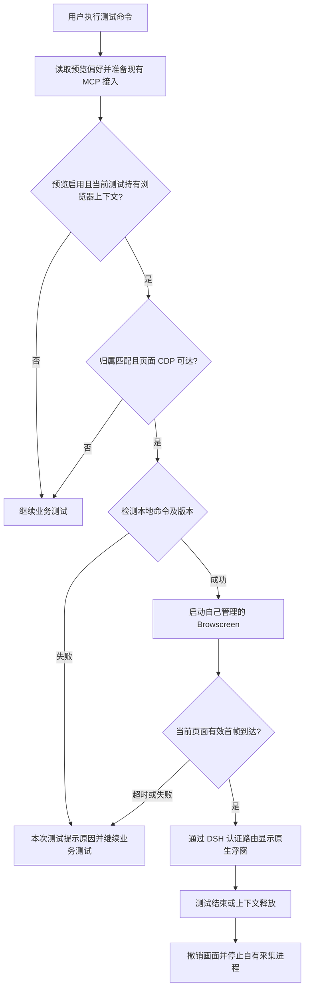

# Browscreen 命令启动改造实施方案

方案日期：2026-10-05。状态：**用户已批准，按本方案实施；交付结果见当前实现及版本记录**。

本方案以插件 `0.8.3`、提交 `3c83040` 为设计基线，保留实施前核实的依赖、约束和拟议步骤。用户已批准按硬切换方式实施，代码、设置界面、测试及当前使用文档随之更新。

已确认的范围调整：插件尚未正式发布，直接切换到本地 Browscreen CLI。删除旧配置兼容、迁移和源码启动回退，统一使用新配置及启动方式。

## 1. 目标与范围

用户在运行 DSH 的电脑上安装一次 Browscreen。此后在插件设置中启用预览，直接执行 `/test`，插件在取得当前测试的有效 CDP 后调用本地 `browscreen` 命令，收到有效首帧后自动显示实时画面。

普通使用者不再需要下载 Browscreen 源码、填写源码项目目录、准备该项目的 `.venv` 或手动启动采集服务。Browscreen 是可选的本机命令依赖，不加入插件的 npm 依赖，也不随插件打包 Python 环境。

本轮改动包括：命令配置、安装与版本检测、直接启动和退出、旧接入代码移除、按需错误提示，以及对应测试和文档。浏览器操作继续使用当前 Playwright MCP，复用 CDP 发布、画面归属校验、认证路由及 DSH 原生浮窗。

本轮保持串行测试及共享浏览器限制。多对话独立浏览器、动态分配预览端口和执行后端替换，继续按[多对话并行测试优化方案](多对话并行测试优化方案.md)留待后续实施。改变 Browscreen 的启动命令本身不会实现对话隔离。

成功标准：

1. 只安装 PyPI 包、没有 Browscreen 源码目录的环境，可以通过设置和 `/test` 显示当前浏览器的实时画面。
2. 设置页能检测 DSH 宿主实际可用的命令、解析其版本，并给出可执行的修复步骤。
3. 没有当前浏览器上下文或有效 CDP 时，不执行运行时版本探测、不启动采集服务、不打开空浮窗。
4. 预览异常有明确原因，但不改变用例断言、报告状态或测试环境隔离规则。
5. 结束、停止、资源释放和宿主正常卸载时，只回收插件自己启动的采集进程。

## 2. 已核实的依赖基线

以下为本次实际读取源码、查询命令和访问 PyPI 的结果；尚未进行改造后的真实运行验收。

| 项目 | 当前事实 |
| --- | --- |
| 本地 Browscreen 源码 | `pyproject.toml` 为 `0.2.1`，提交为 `5fd5744cb46e6fd6b7f9f28d9da424ffe1b3dbaf` |
| 正式 PyPI 包 | 最新为 `browscreen 0.2.1`，wheel 和源码包均未撤回；项目链接指向 Pegasus-Yang/Browscreen |
| Python 要求 | `>=3.14` |
| 版本命令 | `browscreen version` 或 `browscreen --version`；成功输出 `browscreen 0.2.1`，退出码为 0 |
| 版本命令副作用 | 不要求工作目录，不启动 HTTP 服务；源码 CLI 回归覆盖不写入交换文件 |
| 启动入口 | `browscreen --work-dir <已有目录> --host 127.0.0.1 --port <端口>` |
| 采集协议 | 读取 `.cdp`、`.mouse`，通过 `/api/screenshot` 返回 PNG；帧头为 `X-Frame-Id`、`X-Capture-Started-At` |
| 等待预算 | `--connect-wait-timeout-s` 默认 60 秒；超时或采集失败通过截图接口返回明确的 503 错误码 |
| 就绪接口 | 当前没有专门的健康或实例身份接口；不能假设存在 `/health` 等端点 |
| 本机安装情况 | Browscreen 项目内已安装的入口实测输出 `browscreen 0.2.1`；本次非登录命令环境的 PATH 未找到裸命令 `browscreen`。这不能代替 DSH 进程中的安装检测 |

正式 wheel 的 SHA-256 为 `1fc8d2ecc7a84853df67ec0f08370de3a180954a66c61dc9b1c92cca016535b0`，用于后续固定包验收核对。本次没有安装或升级任何包。

源码核实位置为 Browscreen 项目内的 `pyproject.toml`、`src/browscreen/main.py`、`src/browscreen/app.py`、`src/browscreen/models.py` 和 `tests/test_cli.py`。公开来源见 [PyPI 0.2.1](https://pypi.org/project/browscreen/0.2.1/)、[PyPI 元数据](https://pypi.org/pypi/browscreen/json)及 [uv 工具安装说明](https://docs.astral.sh/uv/guides/tools/#installing-tools)。

## 3. 推荐使用流程

下面是**实施完成后的拟议流程**。当前 `0.8.3` 设置页仍要求 Browscreen 项目目录，安装新包不会自动改变旧插件的启动方式。

### 3.1 一次性安装

推荐使用 uv 的独立工具环境安装，避免与测试项目的 Python 依赖混在一起。首次验收固定使用已发布的 `0.2.1`：

```sh
uv tool install --python 3.14 'browscreen==0.2.1' \
  -i http://mirrors.aliyun.com/pypi/simple/ \
  --trusted-host mirrors.aliyun.com
browscreen version
```

已有满足要求的 Python 时由 uv 使用；没有 Python 3.14 时，可先执行 `uv python install 3.14`。如果镜像暂未同步该版本，可从正式 PyPI 获取固定版本 wheel 后用 uv 安装该文件，第三方依赖仍使用上述镜像参数；不改为安装一个不支持版本查询的旧版本。

若 `browscreen version` 提示找不到命令，执行：

```sh
uv tool dir --bin
```

它会告诉用户命令存放在哪个文件夹。在该文件夹路径后加上 `/browscreen`，把得到的完整可执行文件路径填入插件的高级设置，再点击“检测安装”。文档将附上实际字段截图和复制示例。

用户也可以使用自己已安装的虚拟环境入口，例如 `/完整路径/.venv/bin/browscreen`。插件只调用该可执行文件，不再读取源码目录或执行 `uv run --project`。安装发生在 **DSH 宿主所在的电脑**；通过网页连接远程 DSH 时，需要在远程宿主安装。

### 3.2 设置与执行

1. 进入“设置 → 测试插件 → 浏览器实时预览”。
2. 勾选启用，选择已有的兼容 Playwright MCP；通常保留采集端口 `13390`。
3. 命令默认使用 `browscreen`。需要时展开高级设置，填写完整可执行文件路径。
4. 点击“检测安装”，看到命令位置、版本和兼容性结果。检测当前填写的值，不自动保存。
5. 保存设置；下一次测试生效。首次安装或升级插件代码仍需按现有流程重启宿主并刷新页面。
6. 直接执行 `/test 访问ceshiren.com，搜索 python测试开发，打开第一条搜索结果，断言该帖子的正文不为空`。
7. 插件取得当前测试的有效 CDP 后启动 Browscreen；画面符合校验条件后，浮窗自动出现。

用户不用提前运行 Browscreen 服务，也不用增加“打开预览”之类的提示词。检测安装可以在没有浏览器和 CDP 的情况下手动进行；这只查询版本，不启动采集。

## 4. 配置调整

### 4.1 设置页字段

| 字段 | 拟议值或默认值 | 行为 |
| --- | --- | --- |
| `enabled` | `false` | 保留现有显式启用规则 |
| `browscreenExecutable` | `browscreen` | 新字段；支持默认命令名或完整可执行文件路径，高级设置中展示 |
| `port` | `13390` | 沿用现有采集服务端口，不新增动态端口设置 |
| `mcpId` | 空字符串 | 沿用已有 Playwright MCP 选择 |

新保存的设置示例：

```yaml
browserPreview:
  enabled: true
  browscreenExecutable: browscreen
  port: 13390
  mcpId: mcp-playwright
```

允许完整路径中包含空格。该字段是一个可执行文件，不是整条命令；不支持填写 `uv run browscreen`、`browscreen --port 8000` 或 shell 管道。路径需填写实际完整路径，不展开 `~` 或 `$HOME`。运行参数由插件统一生成。

检测结果展示“检测成功/失败”、解析到的命令位置、版本、建议下一步。检测中的按钮显示忙碌状态；修改命令后清除旧检测结果，避免把上一次成功误认为当前配置有效。保存和检测独立，保存时仍核对字段格式及 MCP 选择。

删除 `browscreenProject` 字段及对应的 schema、类型和目录输入，不保留废弃字段，也不生成迁移提示。

### 4.2 运行配置与开发宿主

设置页使用 `browserPreview`；插件准备阶段把它转换为内部运行配置。开发宿主或显式部署配置也可以直接提供以下新格式：

```yaml
preview:
  workDir: /完整路径/preview-workspace
  browscreenUrl: http://127.0.0.1:13390
  browscreenExecutable: browscreen
```

`browscreenExecutable` 省略时统一使用 `browscreen`。`workDir` 是运行时交换目录，`browscreenUrl` 确定插件启动服务时的本机监听地址和端口；它不再表示需要自行启动的外部服务。

MCP 的 `DSH_TEST_PREVIEW_DIR` 必须与 `workDir` 一致。设置页模式自动生成目录并接入 MCP；开发宿主脚本使用 `DSH_BROWSCREEN_EXECUTABLE` 指定命令，默认 `browscreen`，保留 `DSH_TEST_PREVIEW=0` 关闭开关。

提供设置页偏好时优先使用它，显式关闭就不启用；未提供设置页偏好时可以使用上述新运行配置。两种配置入口均只使用插件管理的 CLI 服务，不增加外部服务模式或来源识别逻辑。

## 5. 直接切换规则（已确认）

按用户要求，直接采用新配置和新启动方式，不承担旧预览接法的兼容保证。

1. 删除 `browscreenProject` 和 `DSH_BROWSCREEN_PROJECT`，删除源码目录、`pyproject.toml` 和项目 `.venv` 的检查。
2. 删除 `uv run --no-sync --project` 启动和对应缓存环境变量，只有直接调用已安装可执行文件这一条启动路径。
3. 不读取旧项目字段来推导命令，不自动寻找旧项目的虚拟环境，不保存旧字段或增加迁移状态。
4. 删除“省略项目/命令字段时连接外部服务”的隐式分支；配置预览后由插件按有效 CDP 条件启动并管理自己的采集服务。
5. 新设置、开发宿主脚本、当前部署示例和验收脚本全部使用新合同；删除旧接法的专用测试，不编写迁移测试。
6. 当前使用文档统一描述命令安装和配置。历史设计及验收记录保留当时事实，并在导航中区分历史资料与当前方案。

启用预览仍需本机安装受支持的命令；缺失时按需提示，业务测试继续执行。不自动改写用户的整个 DSH profile，也不影响模型和认证配置。

## 6. 安装检测与版本约束

新增一个职责明确的宿主模块 `src/browscreen-command.ts`，负责命令校验、路径解析、版本查询和检测结果；不建立通用进程框架。

1. 命令为默认 `browscreen` 时，在 **DSH 宿主进程的 PATH** 中解析；指定完整路径时直接核对该文件。
2. 使用 Node 内置文件和子进程能力，不启动登录 shell、不读取用户 shell 配置，也不把整条命令交给 shell 执行。
3. 对同一个解析后的完整可执行文件执行 `version`，检测和实际启动保持一致。
4. 探测成功要求退出码 0、标准输出为 `browscreen <版本>`；区分不存在、不可执行、超时、退出失败和版本格式错误。
5. 版本查询上限拟为 5 秒，输出采用有限缓冲；到期回收该探测进程，不能阻塞测试或设置页。
6. 拟允许稳定版本 `>=0.2.1,<0.3.0`，真实验收固定 `0.2.1`。这个范围是插件的兼容策略，不表示尚未发布的补丁已通过实测。旧版本、预发布版和 `0.3.0` 及以上给出明确提示，复核适配后再扩大支持范围。

设置页新增认证路由 `POST /test-preview-settings/check`，请求只包含当前填写的可执行文件值，返回结构化检测结果。沿用宿主 `authorizeIndex`，限定精确路径、方法和有界请求体；GET 元信息读取不执行版本查询。检测不会保存设置、修改 MCP、准备浏览器或启动采集服务。

首次有效 CDP 确认后进行版本检测；每个当前归属和端点的启动尝试只检测一次，不随 300 毫秒画面轮询重复执行。下一次运行重新检测，避免继续使用升级前的结果。插件不自动安装、下载、升级包，也不调用 `uvx` 临时补依赖。

Python 是否可用由已安装的命令及包安装过程负责；插件不额外寻找 Python 解释器或创建虚拟环境。安装说明直接写明 Python `>=3.14`。

## 7. 运行链路与浮窗条件



采用 Node `spawn(executable, args, { shell: false })`，启动参数由插件生成：

```text
browscreen
  --work-dir <插件准备的交换目录>
  --host 127.0.0.1
  --port <用户配置的端口>
  --connect-wait-timeout-s 60
```

以上参数按默认设置展示；显式 `preview` 运行配置从经过校验的本机服务地址确定监听地址及端口。移除服务启动中的 `uv run --no-sync --project` 和专用于它的 `UV_CACHE_DIR`；不改变 CDP 初始化器，也不要求 Browscreen 项目增加新接口。

继续执行以下浮窗条件：

- 当前运行未结束、未被资源隔离，且当前用例确实持有 `browser_context`。
- `owner.json`、`cdp.json` 与 `.cdp` 的运行、用例、目标及端点匹配。
- `/json/list` 表明只有一个符合当前目标的页面；其他运行的 CDP 或多页面情况不启用预览。
- 自有子进程存活且完成监听；收到自身启动日志只证明监听就绪，仍需有效 PNG。
- 帧 ID、捕获时间和 PNG 签名符合要求，帧不早于本次 CDP 发布，且沿用 5 秒新鲜度限制。
- 所有异步结果再次核对现有 `generation` 和运行归属，迟到的探测、启动或画面不能进入新运行。

画面继续经 DSH 认证同源路由转发，用户网页不直接嵌入采集服务的 localhost 地址。没有有效首帧时 `ready=false`，不创建浮窗。普通对话、无 CDP 的 API 或 App 任务均不出现空窗口。

## 8. 进程生命周期与有限等待

| 阶段 | 拟议处理 |
| --- | --- |
| 端口已占用 | 启动前检查；提示换端口或检查占用进程。不会自动连接该端口上的未知服务，更不会按端口杀进程 |
| 检查端口后发生争用 | 仍以自有子进程的监听结果和退出结果为准；失败后不读取其他服务的画面 |
| 服务正在启动 | 保留当前业务进度，预览等待；从本轮启动尝试开始计算总预算，不因轮询或日志刷新重置 |
| 迟迟没有首帧 | 启动和首帧总等待拟为 60 秒，期间版本探测仍受独立 5 秒上限约束；到期停止自有服务并提示原因 |
| 启动失败或意外退出 | 清空当前帧并记住该归属/端点的失败，不在每次进度查询时无限重启 |
| 浏览器暂时断连 | 清空旧帧，沿用 Browscreen 的有限恢复；恢复有效帧后再允许展示 |
| `browser_wait_timeout` 或 `capture_failed` | 读取既有 503 响应中的错误码，停止失败的自有服务；该目标不再自动重复启动 |
| 用例或目标端点变化 | 先等待旧自有服务退出，再准备新目标；继续按新代次、CDP 和首帧校验 |
| 结束、停止、资源释放、配置切换或插件卸载 | 撤销画面，取消未完成探测，SIGTERM 停止自有服务并等待退出；沿用 1.5 秒后 SIGKILL 的兜底 |

启动监听日志采用有限缓冲拼接，处理跨日志块情况；最终就绪仍由实际帧决定。错误诊断只保留有界退出原因和必要日志，不输出整个进程环境或凭据。

用户修正命令、版本或端口后保存，在当前测试结束后重新执行。这里不自动重放用例，也不增加一套新的环境释放流程。发生既有资源隔离时，仍进入“设置 → 测试插件 → 测试环境”确认释放。

## 9. 按需提示与故障引导

安装了插件但未使用预览功能的用户，不收到全局警告。设置页主动检测时显示结果；运行中的终止性预览问题只属于当前使用该功能的浏览器测试。

`PreviewManager.sync(run)` 和进度展示需明确保留“当前运行实际持有浏览器资源”的判断。即使预览配置准备失败，也不能把同一错误提示传到普通聊天或无浏览器的接口测试。终止原因在该测试的进度区域或详情中显示一行可读说明，提供设置页的路径说明，不创建用于显示错误的空画面浮窗。

| 现象 | 用户看到的说明和处理 |
| --- | --- |
| 宿主找不到命令 | “未找到 Browscreen。请先安装，或在设置中填写完整命令路径并检测。” |
| 终端可用、DSH 不可用 | 说明检测使用宿主 PATH；引导 `uv tool dir --bin`，填写完整路径，避免要求用户盲目修改 shell 配置 |
| 文件不可执行或入口损坏 | 显示命令位置及简短失败原因，引导重新安装或选择正确入口 |
| 版本不受支持 | 显示实际版本与允许范围，提供指定基线安装说明 |
| 版本探测超过 5 秒 | 明确查询超时，引导在宿主上执行同一命令的 `version` 排查 |
| 端口被占用 | 显示当前端口，提示改用空闲端口；不建议直接终止未知进程 |
| 有 CDP 但首帧超时 | 说明浏览器操作可继续；进入设置检查采集服务、端点或日志，然后重新执行 |
| 浏览器上下文尚未产生 | 正常等待，不把这一阶段当安装失败；没有窗口 |
| 测试环境被隔离 | 沿用现有设置页环境释放及用户确认提示，不因预览失败自动解除隔离 |

Browscreen 只影响可视化。用例的业务断言成功仍需真实证据；画面显示或采集失败都不能作为业务 PASS/FAIL 的替代依据。

## 10. 代码和文档改动清单

以下为审核通过后的拟议范围，最终按实际实现更新。

| 文件或模块 | 改动内容 |
| --- | --- |
| `src/preview-preferences.ts`、`src/config.ts` | 新增可执行文件字段及检测结果类型；删除旧项目字段；统一 CLI 配置，保留显式启用/关闭 |
| 新增 `src/browscreen-command.ts` | 命令解析、版本检测、兼容性检查、超时和有界输出 |
| `src/preview-setup.ts` | 删除源码目录和 `.venv` 必填校验，生成 CLI 运行配置；保留 MCP 接入行为 |
| `src/preview.ts` | 直接启动命令，接入探测、启动等待、失败抑制及自有进程清理；保留当前 CDP 与帧门禁 |
| `src/index.ts` | 注册安装检测路由，沿用认证；保留预览异常不阻断业务执行的接入方式 |
| `src/client/preview-settings.tsx` | 替换项目目录输入，增加高级路径与检测安装、版本结果和安装引导 |
| `src/client/progress-dock.tsx`、相关进度模块 | 只为使用预览的当前浏览器运行展示终止原因；复用现有布局及状态，保持按需提示 |
| `scripts/start-host.mjs` | 开发宿主改用 `DSH_BROWSCREEN_EXECUTABLE`，默认 `browscreen`；删除相邻源码目录探测，保留预览关闭开关 |
| `scripts/preview-settings-e2e.mjs`、相关测试 | 消除旧源码路径假设，删除旧接法专用测试，验证新配置、检测、直接启动及不启动场景 |
| `README.md`、`README.en.md` | 简述安装本机命令、设置启用及详细指南入口 |
| 当前用户指南、中英文安装运维文档、常见问题 | 统一命令安装、版本、PATH、启动方式及故障速查，移除当前使用说明中的源码接法 |
| `doc/architecture/当前实现.md`、`doc/README.md` | 同步当前链路及文档导航 |
| `changelog.md`、发布版本信息 | 实现完成后记录变化；发版时按既有规则更新版本、附注标签和交付记录 |

历史设计和验收文档保留原貌；不把旧的源码接入验收改写成 PyPI 命令接入已通过。Browscreen 源码仓库及 DSH 核心代码预计无需修改。

## 11. 分阶段实施与验证

| 阶段 | 执行内容 | 验证和交付 |
| --- | --- | --- |
| P0：方案审核 | 直接切换已确认，审核其余使用流程、版本范围和按需启动条件 | 用户确认完整方案后才进入后续阶段 |
| P1：命令与配置 | 解析器、版本探测和新配置字段，删除旧字段及外部服务分支 | 新命令/配置测试及类型检查通过；不依赖真实 Browscreen 安装的回归可稳定运行 |
| P2：启动与生命周期 | 替换 uv 启动，增加有限等待和失败抑制，保留归属及帧校验 | 使用受控测试入口复现启动、退出、超时、端口冲突和代次切换，检查只清理自有进程 |
| P3：设置与提示 | 安装检测、版本显示、安装说明和当前测试的错误引导 | DSH 页面验证保存、检测不保存、刷新持久化、路径带空格、错误提示及无空浮窗 |
| P4：真实包验收 | 在隔离部署环境中安装 PyPI 0.2.1，运行真实浏览器用例及无 CDP 用例 | 独立安装包中的插件、真实 headless Playwright MCP、首帧和连续画面、结束回收均有证据 |
| P5：文档与发布 | 更新当前说明、常见问题、changelog，分批提交 | 全部相关检查通过，再创建与交付提交一致的附注版本标签 |

拟发布版本为 `0.9.0`，理由是新增命令配置与检测能力，并改变旧源码接入的依赖要求。该版本号为方案建议，当前不升版、不创建标签。发布时遵循[版本发布与 Git 标签](../deployment/版本发布与Git标签.md)。

## 12. 验收矩阵

### 12.1 自动化回归

| 场景 | 必须验证的结果 |
| --- | --- |
| 默认命令及完整路径 | 按宿主 PATH 解析；含空格路径作为单一可执行文件传入，无 shell 拆分 |
| 不存在、不可执行、不支持的版本、格式错误、非零退出、查询超时 | 明确结果、有界等待、没有采集进程；命令错误不会把业务结果改为通过 |
| 新设置、运行配置、默认命令及显式关闭 | 新配置合同和优先级正确；默认值统一；关闭时不检测或启动服务 |
| 普通聊天、预览关闭、API、无浏览器资源、无 CDP、错误归属 | 不调用版本命令，不启动 Browscreen，不出现预览警告或空浮窗 |
| 有效 CDP、正常 CLI、有效首帧 | 精确启动参数；`ready` 在有效 PNG 后才变为 true |
| 无首帧、过期帧、多页面、不同目标 | 不展示；到期提示原因；不会显示另一运行或旧页面的截图 |
| 进程退出、占用端口、采集超时/失败 | 清空帧，错误不会触发每 300 毫秒重启 |
| 迟到的版本结果或启动结果、切换运行、停止 | 按代次拒绝旧结果，不遗留新启动的旧归属进程 |
| 正常关闭和忽略 SIGTERM 的测试进程 | 自有进程按既定策略退出；其他进程和浏览器不被预览模块终止 |
| 检测路由及设置交互 | 宿主认证、方法/路径、字段及有界请求校验有效；检测不保存、不修改 MCP |

使用 Vitest 及受控命令/服务测试复现实际失败边界，不只断言实现内部方法被调用。随后执行 `pnpm typecheck`、`pnpm build`、单元及相关集成测试，并检查新 tgz 的实际内容。

### 12.2 真实运行验收

1. 在仓库外的隔离部署目录创建 `.venv`，使用 uv 从 PyPI 安装固定的 `browscreen==0.2.1`，按正式 wheel 哈希核对；不使用源码 editable 安装，也不依赖相邻 Browscreen 目录。
2. 将独立打包的插件安装到隔离 DSH Web profile。测试数据、浏览器 profile、输出目录及端口与日常宿主分开，不覆盖现有会话配置。
3. 验证命令路径模式；再用配置过 PATH 的隔离宿主验证默认 `browscreen` 模式。设置页显示相同安装版本，服务由该入口直接启动。
4. 通过 `/test` 执行网页用例，核对计划、业务断言、当前 CDP、有效 PNG、连续帧和真实页面变化。截图接口 200 或构建通过不能单独代表整条链路验收。
5. 执行纯接口用例及无浏览器资源场景，确认无版本探测、采集进程、安装警告或空浮窗；App 场景只验证无 CDP 的展示边界，不宣称新增了 App 自动化能力。
6. 验证开始后停止、正常结束、关闭并手动重开浮窗、切换运行，以及预览端口冲突和无效命令的恢复步骤。
7. 核对插件启动的采集进程退出、其他服务仍在；如果浏览器清理失败，既有隔离与设置页释放流程仍然有效。
8. 在用户当前 DSH 中复核一次真实接入。更新插件和重启用户宿主前明确当前会话状态及实际影响，使用既有安装流程，不以隔离 profile 的成功代替该环境验收。

验收证据保存在被忽略的本机目录中，公开文档只记录必要结论、版本、测试范围和限制；不提交宿主凭据、实际会话文件或包含个人路径的原始运行日志。

## 13. 审核要点

直接切换已按用户要求确定：彻底删除旧项目字段、源码启动、迁移和外部服务复用分支。其余方案保持如下，确认完整方案后实施：

- 保留显式启用、端口和 MCP；新增一个高级命令路径字段及安装检测按钮。
- 以 Browscreen `0.2.1` 为验收基线，拟允许 `>=0.2.1,<0.3.0` 的稳定版本。
- 运行时检测和启动均在当前有效 CDP 确认后发生，浮窗继续等待有效首帧；没有浏览器/CDP 的任务不出现相关提示。
- 本轮交付建议为插件 `0.9.0`，多对话并行仍为后续优化。

方案审核已完成。实际交付行为以[当前实现](../architecture/当前实现.md)、[配置指南](../user-guide/浏览器实时预览一步一步配置.md)及[版本记录](../../changelog.md)为准。
