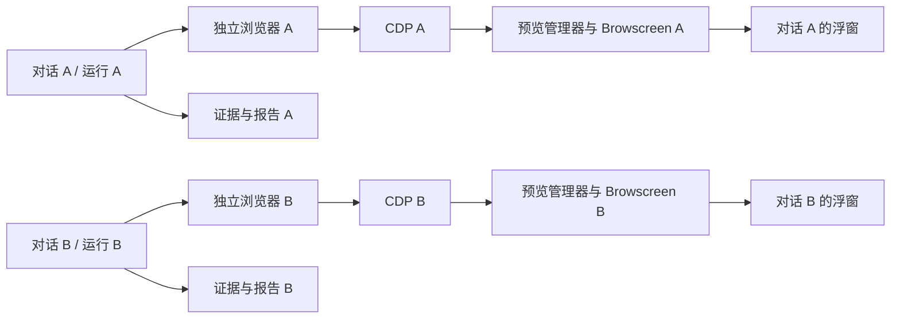

# 多对话并行测试优化方案

记录日期：2026-10-04。状态：**后续优化，尚未实施，也尚未完成兼容性和真实并行验收**。

本文以插件 0.8.0 的当前代码为基线，记录需求、现有问题、候选实现路径和验收标准。本轮只保存方案，不取消当前的串行限制，不替换 Playwright MCP，不增加新的设置字段。具体开发版本和时间暂未确定。

## 1. 要解决的问题

希望在同一个 DeepSeek Harness（下文简称 DSH）中，多个对话能够同时执行不同用例。例如：

- 对话 A：访问 ceshiren.com，搜索“python测试开发”，打开第一条搜索结果，断言帖子的正文不为空。
- 对话 B：访问另一个测试页面，完成登录并断言登录结果。
- A 和 B 各自显示步骤、耗时、报告及所属浏览器的实时画面；停止 A 后，B 继续运行。

可以把每个对话理解为一个人，每个人有自己的浏览器和记录本。A 翻页、关闭浏览器或整理记录，不应该动到 B 的东西。

首轮优化范围建议为“不同对话之间并行，同一对话一次只执行一个测试批次”。同一批次中的用例和 CSV 数据行继续按已有规则串行执行，不同时增加批次内部并行。API 用例也应能够跨对话独立执行；App 用例仅约定隔离要求，不因此宣称当前插件已有完整的 App 执行能力。

**保留现有预览规则：只有取得属于当前运行的可用 CDP，并且取得有效首帧后，才打开实时画面浮窗。API、App 或其他没有 CDP 的运行不打开空浮窗。**

## 2. 当前实现与限制

以下是 0.8.0 的代码事实，不表示插件已支持并行。

| 当前实现 | 对并行的影响 | 代码依据 |
| --- | --- | --- |
| `NativeTests.start()` 使用 `starting` 和所有未关闭测试的检查，限制整个插件实例一次只有一个活跃测试 | 第二个对话的测试会被拒绝；当前不是自动排队，API 用例也经过这个检查 | [native-test.ts](../../src/native-test.ts) |
| 测试记录按 Agent 保存，但浏览器工具固定调用 `mcp__playwright__…` | 保存了不同对话的状态，不代表工具已经连接到不同的浏览器 | [native-test.ts](../../src/native-test.ts)、[adapters.ts](../../src/adapters.ts) |
| 一个 `NativeTests` 持有一个 `PreviewManager`，管理一个当前归属、画面和 Browscreen 子进程 | 单纯删除测试锁，会造成预览归属切换或互相清理 | [preview.ts](../../src/preview.ts) |
| 自动接入使用 `.browser-preview/<插件实例 ID>` 目录和设置中的一个预览端口，并编辑选中的 MCP 配置 | 同一实例的并行运行可能覆盖归属/CDP 文件或争用端口；运行中重新连接共享 MCP 也可能打断另一用例 | [preview-setup.ts](../../src/preview-setup.ts) |
| CDP 初始化器从实际页面和 Chromium 取得端点，并在预览目录发布 `.cdp`、`cdp.json` 等文件 | 当前自动获取能力可以研究复用，但发布目录和归属需要按运行拆分；不能假定换成 CLI 后自动兼容 | [cdp-publisher.ts](../../src/cdp-publisher.ts) |
| 工具事件和 guard 主要按当前测试 Agent 处理 | 另一普通对话仍可能调用同一个共享 Playwright MCP；现有检查不是对所有对话的浏览器访问隔离 | [native-test.ts](../../src/native-test.ts) |
| 无法确认清理完成时使用输出根目录中的全局 `quarantine.json` | 需要区分某个独立资源失败与共享环境未知；只删隔离文件会丢失已有保护 | [native-test.ts](../../src/native-test.ts) |
| 前端和预览路由已按对话/运行检查归属 | 可作为展示隔离的基础，但服务端仍需选择对应运行的管理器 | [progress-access.ts](../../src/progress-access.ts)、[前端入口](../../src/client/index.ts) |

因此，改用本地 Playwright 命令行只是候选执行方式。**取消全局锁之前，必须先完成浏览器、采集、预览和清理的资源隔离。** 两个独立 DSH 进程也不能仅因进程不同就认定安全；如果共享浏览器、profile、输出目录或端口，仍然可能干扰。

## 3. 候选执行方式

### 3.1 本地 Playwright CLI：优先验证的候选

官方 `@playwright/cli` 提供 `playwright-cli` 命令，支持通过 `-s=<名称>` 指定命名会话。以下只用于说明会话分配方式，不是本插件已经提供的命令：[官方会话说明](https://github.com/microsoft/playwright-cli#sessions)。

```sh
playwright-cli -s=dsh-run-a open https://ceshiren.com
playwright-cli -s=dsh-run-b open https://example.com
playwright-cli -s=dsh-run-a snapshot
playwright-cli -s=dsh-run-b snapshot
playwright-cli -s=dsh-run-a close
```

插件应为每次运行生成唯一名称，并在每条命令中固定注入会话参数。正式名称还应包含宿主实例标识，避免不同 DSH 进程生成同名会话；不能让模型自行决定目标会话，也不能漏写参数后落入默认会话。工作目录、配置文件、输出和需要持久化时的 profile 也必须分别分配。

官方 CLI 同时提供 `close-all`、`kill-all` 等全局命令，测试适配器不能将这些作为单个运行的清理操作。命名会话能力有公开文档依据，但本项目尚未验证所选 CLI 版本的实际浏览器进程边界、取消行为和 CDP 发布方式。[官方命令说明](https://github.com/microsoft/playwright-cli#sessions)

这条路径需要新增受插件控制的工具入口和可信采集适配器。不能只在提示词中要求模型通过通用 shell 调用 CLI，然后把退出码 0 当作断言通过；也不能直接复用当前 MCP 响应格式解析器。

### 3.2 每个运行独立的 Playwright MCP

保留现有 MCP 操作方式，为每次运行创建独立的 MCP 客户端、服务进程和浏览器资源，并只向所属 Agent 暴露对应工具。

优点是更容易沿用现有操作与采集逻辑。主要问题是 DSH 公开接口能否可靠创建、绑定和销毁这些实例，以及同名工具在不同 Agent 作用域中的解析是否正确。需要先在当前宿主版本完成探针，不能通过修改共享 MCP 的配置来模拟隔离。

这条路径仍需改造全局测试锁、预览管理器、目录、端口和隔离记录。MCP 本身不是不能并行；问题在于是否给不同运行提供了真正独立的实例。

### 3.3 `npx playwright test` 的边界

`npx playwright test` 是运行预先编写测试脚本的测试运行器，支持 worker 并行，适合已固化用例的回归。它与逐步交互的 `playwright-cli` 不是同一种入口，不能直接替代当前原生 Agent 的探索和执行循环。[官方并行说明](https://playwright.dev/docs/test-parallel)

### 3.4 选型建议

| 路径 | 适用情况 | 需解决的主要问题 | 本文结论 |
| --- | --- | --- | --- |
| 命名 CLI 会话 | 原生 Agent 通过本地命令持续操作页面 | 新工具/采集适配、真实资源边界、取消和 CDP 接入 | 优先做兼容性探针，不提前确定替换 MCP |
| 独立 MCP 实例 | 保留现有工具语义和采集方式 | 公开作用域接口、实例生命周期和启动成本 | 同阶段验证，依据结果决定首轮方案 |
| Playwright Test worker | 已生成并固化的脚本回归 | 脚本合同、报告接入 | 独立的后续方向，不纳入本次并行优化首轮 |

首轮只落地一种经过验证的独立执行后端，保留现有串行 MCP 使用路径，避免同时维护多个尚未验证的实现。

## 4. 拟议资源隔离设计

### 4.1 对话与运行分别标识

| 标识 | 含义 | 使用规则 |
| --- | --- | --- |
| `sessionId` | DSH 对话对应的执行 Agent 标识 | 查找当前活跃测试、进度和浮窗；需在探针中确认具体绑定方式 |
| `suite_run_id` | 一次测试批次的运行 ID | 沿用现有运行、证据和报告归属 |
| `case_run_id` | 批次中的一个用例/数据实例 | 沿用当前采集、断言和清理绑定 |
| 浏览器会话键 | CLI 会话名或独立 MCP 实例的内部键 | 插件生成，包含宿主实例和运行标识；不由模型或页面内容指定 |
| 资源代次 | 同一所有者重建资源后的序号 | 防止旧进程响应、旧 CDP 或迟到画面进入新运行 |

保留按对话查找测试的注册表，新增按运行持有资源的记录。将“整个插件一次一个测试”的检查改为“同一对话一次一个活跃测试”，再根据可用资源限制实际执行并发数。并发检查和资源登记必须作为一次原子预留，避免两个同时到达的启动都认为自己可以占用同一资源。

浏览器执行适配器只承担当前需要的职责：打开所属浏览器、执行动作、采集真实值、保存截图和关闭所属资源。现有计划、原生审批、断言和报告合同继续使用，不另建一个绕过宿主的执行循环。

### 4.2 每次运行持有自己的资源



拟议目录如下；实际文件名在实现时确认，不改变现有报告和证据合同：

```text
artifacts/runs/<suite_run_id>/
  plan.json、events.jsonl、results.json、report.html
  evidence/
  runtime/
    browser/             本运行的配置、CLI 输出和需要时的独立 profile
    preview/             本运行的 owner.json、cdp.json、.cdp 和预览临时数据
```

- 首轮以运行结束后释放浏览器为默认建议，不跨对话复用浏览器；批次内各实例继续遵循现有上下文和清理规则。
- API 运行不创建浏览器和 Browscreen。未来 App 执行应使用单独的设备资源规则，不能自动套用浏览器资源标识。
- 浏览器上下文可以隔离 Cookie 和本地存储，但这不能证明浏览器关闭操作或进程已经隔离。首轮应验证独立浏览器的拥有和关闭边界。[官方上下文隔离说明](https://playwright.dev/docs/browser-contexts)
- 并发子进程使用各自的环境变量副本和工作目录，不在启动期间反复修改宿主共享的 `process.env`。
- 启动时保存设置快照。设置修改只影响后续运行，不重新配置或重连其他正在工作的执行后端。
- 多个 DSH 进程共用输出根目录时，也必须保证运行 ID 和运行时目录唯一；使用外部共享资源时需要额外的跨进程占用证明，无法确认则拒绝并行接入该资源。

### 4.3 CDP 与实时预览

每个浏览器运行持有一个自己的 `PreviewManager` 和需要时的 Browscreen 子进程。CDP 发布数据绑定运行、用例实例、资源代次和 `targetId`；端口从实际运行取得，不能根据对话序号猜测或写死为 9222。

当前 Chromium 自动获取端口和实际页面端点的思路可以复用，但 CLI 的页面初始化和端点导出方式需重新验证。**CLI 能执行页面操作，不代表插件就能取得它的 CDP。** 取得不到 CDP 时允许测试继续，说明预览不可用且不创建浮窗。

Browscreen 的 HTTP 监听端口也要按运行分配。首先验证其是否支持由系统分配端口及返回实际地址；如果不支持，再采用受控端口分配与启动冲突重试。当前设置里的一个固定端口不能直接供两个子进程同时监听，不能使用“提前找一个空闲端口”后不检查实际启动结果的方式。

先确认 CDP 属于当前运行且目标可用，再启动本运行的 Browscreen；取得有效首帧后，前端才收到可展示状态并创建浮窗。切换对话时展示所选对话所属运行的画面；结束或停止 A 只关闭 A 的浮窗和预览子进程。保留当前手动关闭后的行为。预览不可用或服务失败不改变业务断言结果。

首轮继续保留多页面归属不明确时禁用预览的限制；多标签页目标选择不在本次范围内。外部已经启动的共享 Browscreen 服务，也不能在没有明确运行与目标映射时默认用于并行测试。

### 4.4 可信采集和清理

当前确定性断言规则保持不变：冻结预期，从实际执行后端采集观察值，保留原始输出，再进行比较。模型说明、截图可见或命令成功都不能单独构成 PASS。

新适配器在工具调用开始时就绑定对话、运行、实例、步骤、尝试和调用 ID。解析器固定对应后端版本，原始返回及附件写入所属运行目录。旧运行的迟到返回只能作为旧运行审计信息，不能写进另一个活跃运行。

停止操作必须能够定位所属命令、浏览器和子进程树，并处理命令退出后仍然存活的浏览器服务。只终止有明确创建归属的资源，不能按进程名称批量结束，也不能使用 CLI 全局关闭命令。清理不能提前释放执行名额；确认资源已关闭或进入隔离处置后，才结算名额和运行状态。

新设计对能够明确定位的独立资源按运行隔离：A 清理失败保留 A 的错误和资源记录，B 可在证明其独立时继续。无法确认归属的旧共享环境仍采用保守阻断；不能自动删除旧 `quarantine.json`，也不能把未知状态改成已清理。

## 5. 拟议执行流程

1. 检查当前对话是否已有活跃测试，登记新运行并保存设置快照。
2. 按现有规则生成、修订和审核计划。建议此阶段不占用浏览器执行名额，也不启动预览；一个对话等待审核时，另一个对话可以执行。
3. 计划允许执行后，原子预留并发名额并创建本运行资源。达到上限时按最终选定的拒绝或排队策略处理，不能显示为已经执行。
4. 通过绑定后的工具执行，按所属运行更新步骤、可信证据、断言及实际耗时。排队、审核和业务执行时间分别记录，不能将等待时间伪装为工具耗时。
5. 若出现属于本运行的 CDP 和有效首帧，才启动对应画面展示；其他类型测试只有进度和报告。
6. 完成、失败或停止后，清理所属资源，关闭对应浮窗，保存结算结果，再释放名额。宿主重启发现未结算运行时只记录和处置，不自动重新执行测试动作。

以上是拟议流程。新的等待状态和预算口径需要在实施阶段明确，并与现有 `WAITING_APPROVAL`、超时和报告规则一致。

## 6. 已知问题与处理方向

| 问题 | 可能出现的现象 | 后续处理方向 |
| --- | --- | --- |
| 只删除全局锁 | 两个用例抢同一浏览器、预览或清理 | 先实现资源隔离，再放开锁；共享后端继续串行 |
| CLI 名称重复或漏写 `-s` | A 在 B 的页面执行动作 | 插件生成唯一键，每条命令固定注入；不允许测试使用默认会话 |
| 普通对话绕过测试工具调用共享后端 | 测试页面被其他对话切换 | 独立后端只对所属 Agent 暴露；验证普通对话不会解析到该资源 |
| 共享 profile、目录、端口或全局环境变量 | 串登录状态、覆盖 CDP、画面串台、启动失败 | 按运行分配，子进程独立环境；检查实际监听和归属 |
| CLI/CDP 接口随版本变化 | 页面能操作但没有预览，采集无法解析 | 锁定版本、运行兼容性探针；失败保留原始输出并明确状态 |
| 切换对话和异步返回存在竞争 | 显示旧帧、把 A 的结果计入 B | 启动时绑定身份，读取和写入时校验运行及资源代次 |
| 取消只结束一次 CLI 命令 | 背后的浏览器或预览服务仍存活 | 验证实际服务生命周期，按所有权清理整个资源集合 |
| 启动失败、宿主崩溃或重启 | 名额泄漏、孤儿进程、未结算记录 | 持久资源归属；启动失败释放已分配资源；重启核验而不自动重放 |
| 运行中修改全局设置或重连 MCP | 另一对话的浏览器被重建 | 每运行设置快照；独立配置应用；存量共享连接不在运行中改动 |
| 浏览器不同但测试账号/业务数据相同 | 重复提交、互相登出、断言不稳定 | 用例声明独立账号或数据；共享业务资源按需要串行，不承诺浏览器隔离能解决后台冲突 |
| 同时启动过多运行 | CPU、内存和模型/API 配额耗尽，预览变慢 | 设有限并发上限，明确上限处理和计时；后续按实测决定默认值 |
| 独立资源和历史全局隔离规则混用 | 一个失败阻断所有用例，或错误放行未知环境 | 新运行按有证据的资源隔离；保留历史共享环境的处置要求 |

## 7. 分阶段实施与验证

| 阶段 | 工作 | 退出条件 |
| --- | --- | --- |
| P0：兼容性探针 | 固定 DSH、CLI/MCP、Playwright 和 Browscreen 版本；用两个不同标记的本地页面，分别验证命名 CLI 会话与 Agent 作用域 MCP；检查进程、取消、可信采集和 CDP | 不依赖模型也能证明两个目标独立，关闭 A 不影响 B；明确不可用接口和后端选择；不需要修改 DSH 核心 |
| P1：执行适配 | 先在单运行模式接入选定后端，复用计划、审批、断言及报告；新增版本固定的可信采集和截图适配 | 现有用例行为保持；错误采集不会产生 PASS；原始输出可追溯到调用 |
| P2：运行资源隔离 | 拆分启动锁、资源登记、设置快照、并发限制和隔离记录；处理失败、取消、迟到结果及重启 | 确认独立后端后才允许跨对话并行；共享后端仍受串行限制；无跨运行清理 |
| P3：预览隔离与设置 | 按运行创建预览管理器、目录、端口和 Browscreen；前端/路由按当前对话选择；同步配置与排错文档 | 两个画面归属正确；无 CDP、API 和 App 场景无空浮窗；设置变化不打断活跃运行 |
| P4：真实 DSH 验收 | 在实际插件安装包中运行两个原生对话，并注入停止、失败、服务重启和配置变更 | 下表验收通过并留存证据；单元测试或构建不能替代真实并行验收 |

P0 没有通过时维持现有行为，记录阻塞接口，不先放开全局限制。具体代码拆分以最小可用改动为准，不预先建立多个后端的通用框架。

## 8. 验收标准

本节全部为待执行标准，当前没有验收结果。

| 编号 | 场景 | 必须证明的结果 |
| --- | --- | --- |
| V01 | 两个对话同时启动不同 UI 用例 | 业务执行时间区间实际重叠；运行、浏览器会话、资源目录和报告互不混用，不只是串行完成得很快 |
| V02 | A 为社区搜索用例，B 为本地标记页用例 | A 的真实正文观察支持“不为空”断言；B 的页面标记和断言独立；两者证据分别绑定步骤和调用 |
| V03 | 切换 A/B 对话并连续查看预览 | 浮窗对应各自目标；CDP、`targetId`、截图标记、视口尺寸和时间戳有一致的归属证据 |
| V04 | A 停止，B 正在执行 | A 的命令、浏览器、预览和浮窗按规则结算；B 继续执行且其资源不被关闭 |
| V05 | A 清理失败或结果迟到 | 保留 A 的错误/隔离信息；已证明独立的 B 不被误停，迟到结果不写入 B |
| V06 | 两个 API 用例，以及 API/UI 混合运行 | 可按上限策略独立执行；API 不创建浏览器或浮窗，UI 只展示自己的画面 |
| V07 | 未取得 CDP、首帧无效或 Browscreen 失败 | 不打开空浮窗；预览错误有可理解的说明，不被计入业务断言成功或失败 |
| V08 | A 等待计划审核、拒绝工具审批或处于排队 | A 不提前执行动作；符合上限条件的 B 能继续；等待、审核和实际执行计时可区分 |
| V09 | 同时到达的启动、达到并发上限、同一对话重复启动 | 无重复资源分配；同一对话只允许一个活跃测试；按明确的拒绝/排队策略提示 |
| V10 | 普通对话调用浏览器、运行中修改设置、存在其他 DSH 实例 | 不操作已有测试的专属浏览器；活跃运行使用原设置；不同实例不会复用目录、会话键和监听端口 |
| V11 | 浏览器/预览启动部分失败、宿主重启 | 无静默资源或名额泄漏；未结算运行不被自动重放，不被伪造为已清理 |
| V12 | 当前串行 MCP 用例和离线报告重建 | 现有入口、预期冻结、确定性断言、清理及报告仍正确；重建不执行工具或调用模型 |

验收应保留版本、两个运行 ID、交错事件时间线、浏览器会话及进程归属、CDP 目标与预览监听地址、带页面标记的帧和报告核验结果。并行场景优先使用可控本地页面重复验证，再执行真实网站的只读业务用例。

## 9. 实施前需确定的事项

1. P0 结果更支持命名 CLI 会话还是独立 MCP？若宿主公开接口不满足要求，保留串行行为并单独评审替代路径。
2. 首版并发上限是多少？达到上限时立即提示还是排队？若排队，如何取消以及如何计算预算？
3. CLI 路径如何安装、固定版本和选择可执行文件？Browscreen 怎样返回实际监听地址？不能将动态端口或 CDP 当作用户需要逐次填写的配置。
4. 旧的固定端口、共享 MCP 和手动预览配置如何兼容？建议保留其串行模式，不自动迁移正在运行的共享资源。

这些取舍在真正开始实现前结合探针结果确认。跨对话浏览器复用、批次内部并行、多标签页目标选择和已固化脚本 worker 回归均保留为独立后续优化，不随本需求自动增加。

## 10. 相关文档与资料

- [当前实现](../architecture/当前实现.md)：当前模块和运行边界。
- [浏览器实时预览一步一步配置](../user-guide/浏览器实时预览一步一步配置.md)：0.8.0 已有配置与使用方法，不包含本文拟议功能。
- [预览设置与自动接入验收](../project/预览设置与自动接入验收.md)：已有真实验收的范围。
- [执行进度与实时预览实施方案](执行进度与实时预览实施方案.md)：现有预览归属和启用规则的设计背景。
- [数据契约与状态规则](数据契约与状态规则.md)：证据、断言、状态和清理的基础约定。

外部依据为 2026-10-04 查阅的 Playwright 官方资料，具体接入能力仍需以 P0 锁定版本实测为准。本文不将官方工具的能力直接等同于本插件已经具备的能力。
