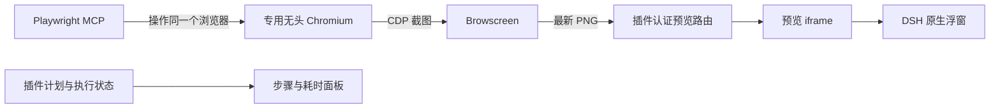

# 执行进度与浏览器实时预览方案

编写日期：2026-10-04。状态：可行性与实施建议，待审核；本文不代表新功能已实现或验收。

## 1. 结论与范围

这两项需求都有插件接入路径：在现有测试插件包中增加浏览器端入口，通过 DSH 官方 UI 插槽展示步骤和实时状态，通过官方右侧栏浮窗承载 Browscreen 预览。依据当前本机源码，不需要修改 DSH 核心，也不需要另建执行 Agent。

需要区分三个能力：

| 需求 | 接入方式 | 当前边界 |
| --- | --- | --- |
| 特定样式、步骤图、流程图 | 插件前端 React/CSS/SVG 组件 | 当前测试插件尚无 client 入口 |
| PlantUML 图 | 先渲染成 SVG/PNG，再由插件组件展示 | DSH 当前 Markdown 不自动渲染 PlantUML 代码块；渲染器需要另行接入 |
| 浏览器画面浮窗 | 注册插件侧栏页，使用宿主 float 能力，在页内挂载预览 iframe | iframe 本身不会获得 Playwright 的浏览器画面，需打通 CDP 与 Browscreen |

推荐首版采用「步骤图 + 实际耗时 + Browscreen 只读预览」。步骤图直接从已有结构化计划生成；PlantUML 可以作为之后的图形输出选项，首版不为简单串行步骤增加渲染服务。

## 2. 核对基线与已确认事实

本机基线：测试插件 `0.6.0`，提交 `cb6482efad74e9b5b4a3494bd0ff5667447f7ccd`；DSH 包版本 `0.2.1-alpha.1`，提交 `5badb15009ae1756c3afe0ae0cef1faafc290ccc`；Browscreen 提交 `32c9bffb29e07866db095e26093ddceeb703a4a4`；Playwright MCP `0.0.68`。

| 已核对事实 | 依据 | 对方案的影响 |
| --- | --- | --- |
| 插件包可以包含 Host 与 Client 两部分 | DSH `packages/client/modules/README.md`，`dsh.client` 和 `./client` 导出 | 可以仍交付同一个安装包，无需向聊天内容注入脚本 |
| 右侧栏提供类型注册、页面插槽和浮窗方法 | DSH `docs/subsystems/sidebar-right.md`；`sidebarRightTabs.register`、`sidebar.right.pane.tab`、`sidebarRight.float` | 使用宿主已有停靠、浮窗和关闭行为 |
| 当前 Markdown 将原始 HTML 显示为文字，普通代码块进入 CodeBlock | DSH `packages/client/ui-primitives/src/markdown/render.tsx` | 直接输出 iframe、PlantUML 或 Mermaid 代码块不会自动变为所需界面 |
| 当前计划已经保存业务步骤和检查点，执行器已有开始、结束事件及耗时 | 本项目 `src/text-plan.ts`、`src/native-test.ts`、`src/recorder.ts` | UI 投影可以复用现有计划与账本，不重新让模型编排 |
| 已有认证 HTTP 路由和报告状态接口 | 本项目 `src/index.ts`、`src/report-access.ts` | 复用宿主认证与路由机制；现有 `/test-reports/status` 是最近选中报告的摘要，不能直接充当按会话隔离的完整步骤状态 |
| 当前配置显式传入 `--headless --browser chromium --isolated` | 本项目 `scripts/start-host.mjs`、部署说明 | 无头是本项目选择，画面预览不要求改为有头 |
| Browscreen 提供自动刷新的预览页与 PNG 接口 | Browscreen `src/browscreen/app.py`、`preview.html` | 复用 `GET /` 或 `GET /api/screenshot`，首版无需新增视频协议 |
| Browscreen 的浏览器级 CDP 连接选择首个 page target，也支持页面级 WebSocket 地址 | Browscreen `src/browscreen/adapters/chrome_cdp.py` | 必须保证采集的是当前自动化页面，多标签不能依靠列表顺序 |

MCP 的实际依赖是 Playwright `1.59.0-alpha-1771104257000`，不同于本项目验收脚本的 `1.58.2`。读取其 `browserContextFactory.js` 确认：Chromium 启动时会分配内部 CDP 端口；配置 `cdpEndpoint` 时走 CDP 连接工厂，保留 `isolated` 时创建独立上下文。内部临时端口尚未通过本项目接口交给 Browscreen，不能把另一个固定端口当作当前浏览器地址。

以上为源码与文档核对结果。本轮未运行新插件前端、Browscreen 联调或真实浮窗验收。

## 3. 步骤与时间展示

### 3.1 用户看到的内容

提交任务时展示「正在规划」。收到有效文字计划后展示任务名称、拆分说明和步骤图；审核入口标为「等待计划审核」，修改草案时更新图，批准后保持计划冻结规则。

例如，下列内容是界面示意，时间为示例值：

```text
当前用例 1 / 4 · 已结算 2 / 4 步 · 已用 00:48（含等待）

✓ 访问网站       4 秒
│
✓ 搜索 agent   12 秒
│
● 打开首条结果  运行中 8 秒
│
○ 核验点赞数    待执行
```

节点显示待执行、运行中、完成、失败、跳过或取消，并提供检查点结果。准备与资源清理作为独立阶段显示，不把清理算作用户业务步骤。批量测试显示用例和数据行，当前实例展开，避免把所有参数化实例堆成一张巨大图。

步骤状态以插件账本为依据。工具调用成功不能使业务检查自动通过；测试失败仍可继续收尾，不能提前把整批标成完成。「已结算」包括失败、跳过等终态，并单独展示通过数，避免把完成比例当作成功比例或剩余时间预测。

### 3.2 实时更新与计时

- 前端读取按 `session_id` 绑定的活动运行，再以 `run_id` 读取脱敏展示快照。不能使用全局最近一次报告替代当前会话状态。
- 首版建议在面板可见时每 1 秒读取快照，计时文字由本地定时器平滑更新。使用已有 HTTP 路由机制，不先增加另一套消息传输服务；该方式是周期刷新，不能承诺零延迟。
- 快照包含计划、当前实例、当前步骤、逐步状态、已完成耗时、服务端当前时间和更新时间。界面不需要完整工具参数、Cookie 或所有观察数据。
- 收到开始、结束、停止和最终结算后的状态变化才更新节点。一次读取取得一致快照，旧请求不能覆盖新运行；刷新页面重新读取权威快照。
- 当前步骤的 `duration_ms` 是从进入步骤到结算的墙钟耗时，可能包含模型思考和人工审批。首版准确标为「已用时间（含等待）」；只有补齐真实等待事件后才能单独计算等待时间，不伪称纯浏览器执行耗时。
- 已有 planning/reviewing/executing/cleanup/finished 阶段可用于总状态；审批等待和用户追问的细分状态，应在核对宿主对应事件后接入。

关闭面板、切换会话或界面读取失败只影响展示，不停止测试、不改变断言、不修改原有计划审核。

### 3.3 图形实现选择

| 方式 | 适合用途 | 代价与建议 |
| --- | --- | --- |
| React/CSS 步骤图，必要时使用 SVG 连线 | 当前串行执行、状态高亮、节点耗时 | 推荐首版；复用业务步骤 ID，状态更新直接作用于节点 |
| Mermaid | 后续需要分支或依赖关系的图 | 需要插件自己引入和调用渲染器，当前聊天代码块没有自动渲染能力 |
| PlantUML SVG/PNG | 需要 UML 表达或图形导出 | 需要本地或服务端渲染链路；实时状态仍来自插件，不能仅输出一次静态图 |

首版按现有真实顺序绘图；JSON 用例存在依赖时可以展示已有依赖，不凭空增加并行或分支执行语义。

## 4. 浏览器画面浮窗

### 4.1 数据路径



iframe 显示图片预览页，Browscreen 获取自动化浏览器的画面。这是持续截图刷新；Browscreen 默认采集间隔为 300 毫秒，实际刷新还受采集和传输耗时影响，不承诺视频级帧率。预览只读，首版不通过 iframe 让用户点击被测网站。

### 4.2 浏览器端点与生命周期

需要先验证两种接法，再冻结浏览器实现选择：

| 接法 | 优点 | 需要解决的问题 |
| --- | --- | --- |
| 保持 MCP 自行启动浏览器，向插件交付其 CDP 端点 | 最大程度保持已有启动和关闭行为 | 当前没有稳定的公开端点交付合同；不能依赖私有字段或扫描所有系统浏览器 |
| 集成层管理专用 Chromium，MCP 通过 `--cdp-endpoint` 连接并保持 `--isolated` | 明确共享同一个浏览器，便于交付 `.cdp` 与管理生命周期 | 需要管理自己启动的浏览器，并重验现有初始化、上下文释放、停止和隔离语义 |

推荐用第二种接法做兼容性小验证；验证通过后才作为正式实施方案。浏览器仍使用 MCP 对应版本的 Chromium，不能悄悄换成系统 Chrome。仅在执行阶段确实需要浏览器时初始化，纯 API 任务和计划审核不会因此启动浏览器。

Browscreen 仍作为图像采集旁路服务，不接管测试规划和执行。使用独立工作目录，`.cdp` 指向已确认的目标。若首版限定一个活动页面，需要明确这一使用范围；若支持新标签页与切换，集成层必须维护当前 MCP 页面与 CDP target 的对应关系，向 `.cdp` 写入该页面的 WebSocket 地址。不能仅匹配 URL，因为多个标签可以具有相同 URL。

Browscreen 在正常连接期间不会因 `.cdp` 文本改变自动切换目标。目标切换还需要一个明确的重新连接机制，或在集成层控制观察器重启；这是多标签支持的额外工作，不能把改文件本身算作已完成切换。

停止测试时先遵循现有在途结算和清理规则，再释放集成层拥有的浏览器、采集进程及临时文件。关闭预览浮窗只停止前端读取，不关闭测试浏览器。

### 4.3 iframe 与部署

本机试验可以直接让 iframe 指向 Browscreen 的 `GET /`。正式建议由插件在 DSH 同源地址提供预览页，代理读取固定的 Browscreen `GET /api/screenshot`，复用宿主认证，保持 PNG 帧号、采集时间和 `Cache-Control: no-store`。

不能只把 Browscreen 首页代理到一个子路径后直接沿用：当前 `preview.html` 写死请求 `/api/screenshot`，会落到 DSH 的根路径。应由插件提供调用自身预览路由的轻量页面，或对代理预览页的接口地址作明确适配。

同源路径也适合远程部署，避免把服务端的 `127.0.0.1` 错当成用户机器，及 HTTPS 页面直接嵌入 HTTP 服务的问题。无需新增任意 URL 代理或开放 Browscreen 的 webhook 注册功能。

预览按实际帧元数据显示更新情况，断连或截图失败显示明确状态；保留旧图时必须标为历史画面，不能继续声称实时。Browscreen 原预览遇到错误会清空旧图，插件初期可保持这一行为。

Browscreen 的鼠标图层来自 `.mouse` 文件。当前 Playwright MCP 不会自动写入该文件；首版先验收页面图像，若需要鼠标轨迹，再补充坐标交付合同，不能承诺现成显示自动化鼠标。

## 5. 实施步骤与验收

| 阶段 | 工作 | 必须通过的验证 |
| --- | --- | --- |
| V0 接入验证 | 临时 Client 入口、原生侧栏与浮窗；MCP/CDP/Browscreen 连接小验证 | tgz 安装后前端入口正常加载；浮窗可打开和关闭；PNG 确认来自 MCP 正在操作的页面；上下文关闭后无资源泄漏 |
| V1 进度面板 | 展示快照、步骤图、真实状态和计时 | 草案修改、批准、逐步执行、失败、取消及清理正确；刷新和会话切换不串运行；静态报告与账本结果保持一致 |
| V2 实时画面 | 浏览器生命周期适配、采集服务、同源 iframe、自动打开浮窗 | 无头模式可见点击/导航前后变化；断连显示错误并恢复；关闭浮窗不停止测试；新数据实例不显示前一实例画面 |
| V3 完整回归 | UI/API/参数化/审批/停止回归与文档更新 | 现有断言、报告、原生审核和取消清理检查通过；真实 DSH 网页完成视觉和功能验收 |

V0 需要确认 Client 构建与宿主模块装载格式，不能把当前仅运行 tsc 的构建脚本直接当作浏览器 bundle 方案。安装路径、`dsh.client`、`./client` 导出和前端依赖声明需一起验证。

当前建议首版范围：原生步骤图、每步及整体墙钟耗时、单活动页面只读预览和原生浮窗。PlantUML 渲染、预计剩余时间、鼠标轨迹及多标签自动跟随分别作为可选项，不与基本功能混在一起声称完成。

## 6. 参考与验证边界

- [DSH Client Modules 官方说明](https://github.com/deepseek-ai/deepseek-harness/blob/master/packages/client/modules/README.md)：插件浏览器入口与装载机制。在线 master 可能变化，实施以本机已锁定提交复核。
- [DSH 右侧栏官方说明](https://github.com/deepseek-ai/deepseek-harness/blob/master/docs/subsystems/sidebar-right.md)：注册页面、UI 插槽、浮窗与会话范围。
- [Playwright MCP 官方说明](https://github.com/microsoft/playwright-mcp/blob/main/README.md)：headless、isolated 和 cdp-endpoint 配置；实施以当前安装的 0.0.68 为准。
- [当前测试插件架构](../architecture/当前实现.md)：现有计划、账本、原生执行及资源清理边界。

本轮仅增加设计文档及导航，核对本机源码和官方资料并检查文档链接。没有修改测试运行代码、安装新依赖、启动新服务或完成上述 V0–V3 验收。
