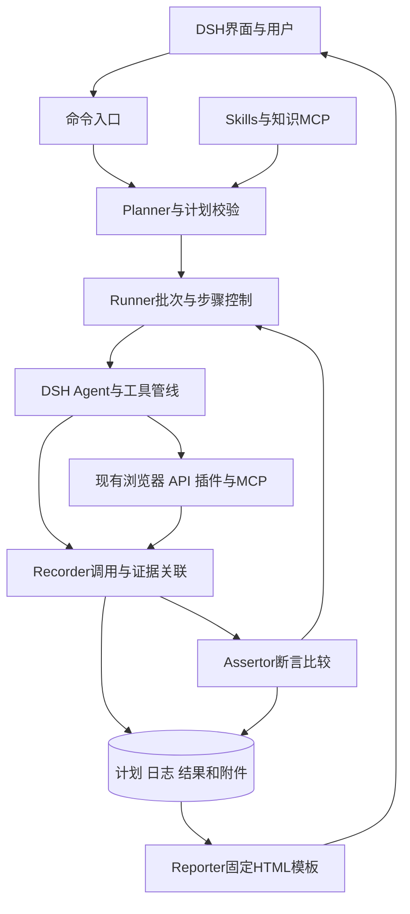
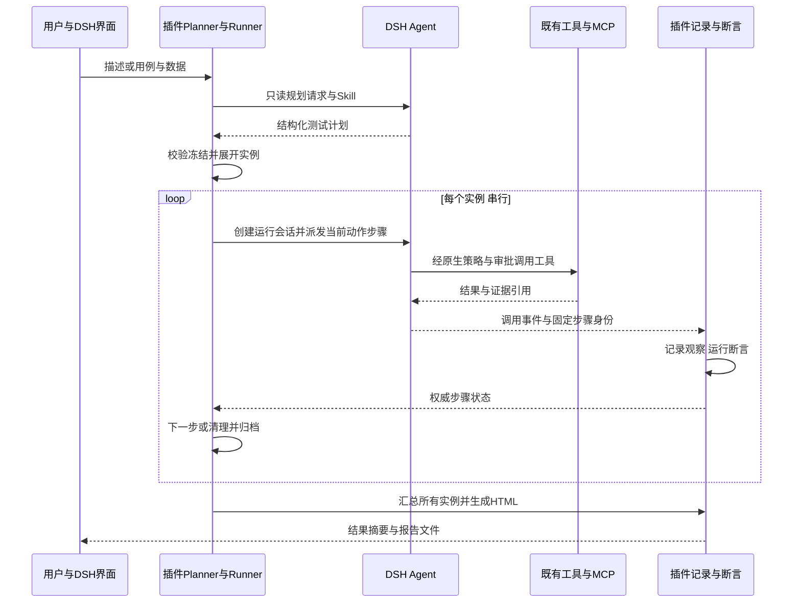

# 插件设计方案

## 1. 目标与边界

开发一个 DSH 原生测试插件，完成四件事：自然语言规划；使用已有扩展执行和收集结果；独立断言与 HTML 报告；多用例/多数据批量汇总。插件是测试流程的控制者，DSH 继续负责模型循环、会话、工具执行和扩展加载。

第一版为单项目、本地运行、Web UI + API、串行批次。保留已有原生审批和 hook 接入。插件内部维护测试状态，不要求独立数据库、Python 服务或完整自研 Agent 框架。

暂不实施多租户、大规模并行、任意脚本生成执行、CSV/Excel 全格式导入、插件市场、DSH 内嵌报告编辑器，以及跨进程自动恢复副作用操作。完整 HTML 文件在浏览器打开即可满足报告交付；嵌入 DSH 面板不是首版前提。

## 2. 需求映射

| 编号 | 需求 | 插件职责 | 主要验收阶段 |
| --- | --- | --- | --- |
| R1 | 描述转执行和断言步骤 | Planner、Schema 校验、预期来源、计划冻结 | M1、M2 |
| R2 | 复用扩展执行和收集 | Agent 作用域、能力选择、步骤绑定、工具事件/证据适配 | M0、M3 |
| R3 | 记录步骤和断言并生成报告 | Recorder、Assertor、Reporter | M1、M3、M5 |
| R4 | 多用例/多数据运行汇总 | 数据展开、串行 runner、隔离/清理、批次统计 | M4、M5 |
| R5 | 运行中的审批、停止与 hooks | 原生审批、取消传播、自有生命周期 hook | M3、M6 |

## 3. 插件内部结构

| 模块 | 拥有的职责 | 不承担的职责 |
| --- | --- | --- |
| Entry | 命令注册、配置、批次入口、状态/停止查询 | 不自己执行模型循环 |
| Planner | 读取任务/规则，提交和校验计划，记录缺口 | 不直接对被测系统做写操作 |
| Runner | 实例展开、当前步骤、预算、终结、清理、会话释放 | 不依靠助手文字决定通过 |
| Tool adapters | 将已选工具返回映射为稳定观察和附件 | 不假设所有已安装插件都可调用 |
| Recorder | 固定调用归属、顺序写事件、保存观察与证据 | 不改写原始预期 |
| Assertor | 根据冻结预期、观察与比较器产生判定 | 不接受模型任意设置 PASS |
| Reporter | 从统一结果投影 HTML 与统计 | 不另算一套状态或让模型生成统计数字 |

首期按上述职责分文件即可，不预先拆成多个包。公开接口兼容风险集中在一个 `host.ts` 适配文件，其余领域代码不依赖 DSH 内部实现类。

## 4. 用户入口与计划形成

拟议命令合同：

| 命令 | 行为 |
| --- | --- |
| `/test <描述>` | 创建规划请求；描述直接使用原文本 |
| `/test-run <计划文件>` | 校验并执行受支持 JSON 用例文件 |
| `/test-status <批次ID>` | 显示当前实例、步骤、等待原因和报告位置 |
| `/test-stop <批次ID>` | 停止业务派发，有界等待在途结算；结算后执行预授权清理，超限则隔离并输出不完整结果 |
| `/test-report <批次ID>` | 从已保存结果重建报告；不重跑测试 |

命令名是插件拟议名称，不是 DSH 自带指令。命令处理器显式驱动规划 Agent；自然语言不因 slash command 自动进入模型。输入路径必须在用户选定工作目录或显式授权位置解析，禁止根据模型文本任意覆盖文件。

规划 Agent 只具备必要只读知识工具及 `test_submit_plan`；执行 Agent 不开放创建新批次工具，避免递归和同会话互等。明确计划校验通过后直接运行；只有预期缺失、规则冲突或扩大授权范围时请用户澄清，不能把所有运行都变成强制计划审批。

完整用例集合逐条解析，保留用户原文与来源定位。计划必须包括步骤、前置、数据、预期、规则引用、必要清理。无预期的草稿允许保存，但不得进入宣告 PASS 的执行路径。格式错误只有限次重试，超过预算输出具体错误。

## 5. 单实例与步骤执行

1. runner 创建实例目录、独立运行 Agent/session 和受信身份映射，配置允许的工具与环境。
2. 按统一 Step 合同执行前置准备，记录已创建资源及浏览器上下文/标签页；前置不满足则 BLOCKED，准备执行错误则 ERROR，部分失败仍保留待清理资源。
3. 当前 `action` 步骤进入 RUNNING 后才向 Agent 派发任务；保持预期只读。
4. 在进入执行管线前固定 `callId → case_run_id/phase/step_id/attempt_id`；覆盖跳过 pre-execute 的早退路径，不能只在该 hook 建映射。公开捕获入口由 M0 验证，无法关联时停止并报 ERROR。
5. 采集调用预先绑定输出槽及上下文，adapter 产生不可变 Observation/Evidence；所有在途调用结算、输出校验和 writer flush 后才能切步骤，不能使用“最新观察”代替固定绑定。
6. `assertion` 步骤只读取冻结输出并保存操作数快照，再执行比较；需要新观察时显式插入只读采集动作。两观察一致性用 expected_observation_ref，独立业务预期另保留。
7. `test_finish_step` 作为控制调用单独记账，不计入它所等待的业务在途集合，避免等待自身；检查其他调用结算、必需输出和写队列后，关闭当前步骤业务准入并调用 `exec.concludeTurn()`。它不能设置结果。runner 等控制调用自身结束及 Agent idle 后再派发下一步，同批尚未执行的业务调用不得越过终结门禁。
8. Agent 自行 idle 但缺少 finish 时，按预算补充；到限仍未完成控制协议记 ERROR。业务观察缺失按数据合同唯一判定表处理，不默认成功。
9. 按必需/可选策略决定继续，提交适用修订；关闭修订入口后执行适用清理并归档。未结算调用走隔离路径，不宣称已释放 Agent。

`concludeTurn()` 不会抢占已提交的其他工作，插件必须在准入处阻止已结束步骤的新动作。同一批工具的调用允许同时在途时，其归属也不能依赖结束时的可变“当前步骤”。首版可选 native 模式以减少 PTC 嵌套适配；是否可行由 M0 实测，不能只在提示词里宣称串行。

## 6. 复用既有扩展的边界

已有 MCP 工具进入 DSH 工具注册表，可复用其发现、调用与错误处理；已有插件的公开工具也走同一管线。只有服务接口的插件需要薄 adapter。Skill 是执行方法/知识，记录其来源和版本，不能把加载 Skill 视为完成动作。

第一版锁定两个具体执行接入点：浏览器和 API。adapter 必须明确返回字段、错误结构、证据位置、上下文身份、采集调用绑定和取消语义。仅返回“成功”只在满足声明的动作完成条件时可记 SUCCEEDED；缺少必要输出为 ERROR，动作完成但业务断言缺证据为 INCONCLUSIVE。原始返回被截断或附件无法访问时不能补造观察。

确定性工具调用可由插件经 `ctx.tools.execute()` 发起，但必须保留正确的 agent、callId、signal 和所选模式合同。不能直接执行工具定义函数绕过门禁。通用 shell、任意写文件及不相关业务工具不在测试 Agent 的默认允许集合内。

## 7. 动态检查点与 hooks

`test_propose_checkpoint` 接受规则引用、适用前提、候选断言及插入边界。runner 校验来源、去重和剩余预算，形成不可变 PlanRevision；只在没有在途工具的步骤边界生效。

允许自动增加已授权范围内且有明确来源的检查，包括影响适用实例结果的必需断言；禁止更改既有步骤的预期、required 和结果。扩大范围、额外写操作或冲突规则需要用户确认。事后新增检查保留 post_hoc 标记，即使 required=true 也不得冒充预先覆盖项。

每个修订冻结适用实例和插入边界，实例持久化 applied_revisions 和有效必需断言集合；先提交应用事件并 flush，再执行新增步骤。适用实例限尚未开始或仍处于业务阶段的实例，不追溯更改已进入清理或终结的实例。正常结束的最后业务边界先处理已入队修订再关闭入口；fail-fast/取消先关闭入口并拒绝未提交建议。按实例实际应用记录重建报告，详细规则见数据合同。

首期提供 `before_step`、`after_observation`、`after_assertion`、`report_ready` 四个自有 hook 点。before_step 拒绝必要业务步骤使实例 BLOCKED，抛错/超时使该步骤 ERROR；可选业务步骤局部问题仅警示。准备和清理按对应阶段合同处理，必要清理被拒绝为 ERROR。后置 hook 只观察或提交建议，抛错/超时或越权修改尝试记警示且不改结果；发生记录或身份完整性错误则为 ERROR。每个 hook 记录开始、结束和错误；修订入口关闭后的建议拒绝并说明原因。

## 8. 审批、停止与异常

原生审批发生在运行 Agent 的 open turn 内。界面需能访问当前实例会话并完成审批；实际路由是 M0 阻断性验证项。无审批答复/拒绝/取消时不得执行动作；拒绝必要动作使实例 BLOCKED，而非 PASS。

`/test-stop` 首先将批次设为 CANCELLING，关闭业务动作和修订准入，再取消活动 Agent。按 manifest 中的 cancel_grace_ms 有界等待；只有在途全部结算后，才用独立清理 Agent 的 open turn 和新信号执行预授权清理，保留原生门禁及可达审批会话。资源未知时隔离，不能因缺少资源 ID 而判定无需清理。DSH 命令处理器提前停止等待不代表副作用停止。

收尾超限时活动实例封存 ERROR，保留 effect_unknown、未结算调用、隔离标记和不完整报告；清理记 SKIPPED，不启动清理工具。未开始实例在用户停止时为 CANCELLED，在工具超时导致隔离时为 BLOCKED。隔离期间禁止新批次，重启不自动解禁；迟到结果只追加审计，不改判或自动清理。运维需核实外部执行停止、重置环境并保存证据后解除隔离。无更高优先级错误/业务失败时，取消且适用清理成功为 CANCELLED；必要清理失败为 ERROR。

必需业务动作 ERROR/BLOCKED、必需业务断言 FAIL/ERROR/INCONCLUSIVE 触发实例内 fail-fast；可选业务检查的 FAIL/INCONCLUSIVE/局部 ERROR 仅警示，后续必需步骤继续。必需步骤不得依赖可选步骤或其输出。记录/身份完整性故障仍停止业务派发，不因发生在可选步骤而降级。实例间继续独立用例，共享依赖损坏时剩余依赖实例 BLOCKED。浏览器、Cookie、账号和后端数据必须单独隔离/重置。

中断后首版只恢复已保存事实，标记 interrupted 并生成不完整报告；不续执行中断的调用。保存失败时停止新动作并报告 ERROR，不承诺必然还能在损坏的输出目录生成 HTML。

## 9. 报告与输出

报告总览展示实例总数、各状态数、用例/数据分布、结果结算率、未结算调用、隔离/不完整标记和耗时。结果封存不等于外部执行完成。详情展示准备/业务/清理时间线、动作调用、观察绑定、断言操作数快照、实例有效修订和证据；不因迟到结果改判。每次尝试均保留，重试次数不增加实例数。

`report.html` 使用本地模板与内联样式/脚本，不依赖外部 CDN；证据使用相对链接，目录可整体复制分享。所有外部文字转义，令牌/密码按固定规则脱敏，插件配置只保存秘密引用，不将秘密复制进计划或报告。证据摘要基于实际归档文件，脱敏后文件明确标识。

不假定 DSH 的 Markdown/文件预览器能运行 HTML。首版返回报告路径，在常规浏览器验证。若后续要求内嵌，再使用前端 slot 扩展；不为首期报告先建设独立 Web 平台。

上游事实、固定版本和待验证项详见 [参考记录](../reference/上游接口与验证记录.md)。
