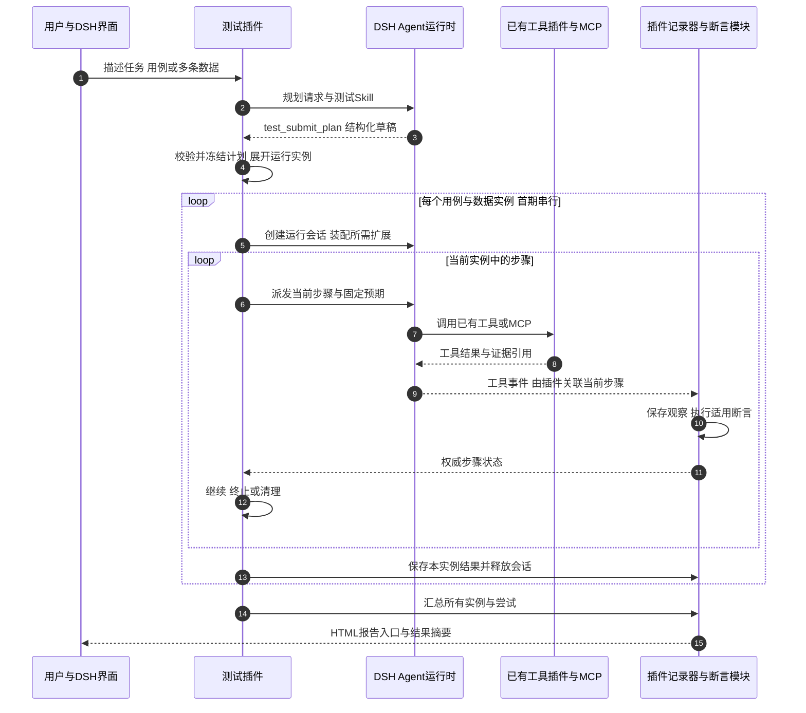

# DeepSeek Harness 纯插件测试流程

日期：2026-10-03。本文针对最新收敛的四项需求：自然语言拆分执行和断言步骤、复用既有扩展执行、记录并生成报告、多用例/多数据运行汇总。基于已核对源码，**四项都可以在 DSH 插件层设计实现，首版不需要外部 Python 服务，也没有发现必须修改 DSH 核心的要求**。这属于源码级可行性判断，尚未完成插件联调验证。

本文件为前期纯插件可行性调研快照；当前实施以 [插件设计方案](../design/插件设计方案.md) 和阶段计划为准。此前 Python 混合方案用于讨论独立测试产品与长期控制权，并非实现当前四项需求的必要条件。

## 1. 四项需求的直接结论

| 需求 | 是否能在插件内实现 | 复用 DSH | 插件必须新增 |
| --- | --- | --- | --- |
| 自然语言转执行与断言步骤 | 可以 | Agent、模型、上下文、Skills、知识 MCP | 结构化计划合同、校验、预期来源和数据绑定 |
| 用已有扩展运行并收集过程 | 可以，前提是扩展提供可调用入口和足够结果 | 工具注册表、MCP client、工具事件、会话日志 | 当前步骤绑定、结果适配、证据归档 |
| 汇总步骤与断言形成报告 | 可以 | 工具调用身份、时间与结果事件 | 独立断言、运行账本、HTML 模板 |
| 多用例/多数据拆分运行并汇总 | 可以 | 创建独立 Agent/session，等待 idle、取消 | 批次展开、调度、隔离、统计和统一报告 |

“纯插件”是交付边界：自有 TypeScript 代码加载到 DSH 内。插件内部仍要写测试专用逻辑，可以使用普通模板/校验库；不等于只写提示词，也不要求重写模型循环、MCP 客户端或整个 Agent 框架。

源码依据：工具注册、执行和事件见 [D2]；MCP 工具注册到 `ctx.tools` 见 [D4]；Skills 见 [D5]；Agent 创建、作用域和生命周期见 [D13] [D14]。

## 2. 最小结构

一个可安装插件包，内部按职责拆分，首期无需多个自有服务：

```text
dsh-test-plugin/
  entry.ts          注册命令、工具和生命周期监听
  plan.ts           TestSuite、执行/断言步骤和数据绑定
  runner.ts         批次展开、逐步骤运行、停止和清理
  assertions.ts     确定性比较与语义检查分类
  recorder.ts       工具事件关联、结果和证据文件
  report.ts        从结构化结果生成HTML
  skills/          测试规划及执行方法
  templates/       HTML报告模板
```

这些是拟议模块，当前尚未创建产品代码。运行结果存放在配置的项目输出目录，以一个 suite_run_id 对应一个报告目录，保存计划快照、events.jsonl、results.json、report.html 和证据附件。日志按顺序写入，在步骤终结和生成报告前等待写入完成；记录失败必须显式报错，不能悄悄生成“全部通过”。

首期本地 JSON/JSONL 即可，不要求先建数据库或调度平台。进程中断后可以从已保存事实生成“不完整运行”报告；精确断点续跑和副作用核对另设后续能力，不冒充已具备。

## 3. 用户怎样启动

推荐提供插件自定义的 `/test` 命令，例如：

```text
/test 验证登录功能，分别使用有效密码和错误密码；成功应进入首页，失败应显示凭据错误。
```

`/test` 是拟议命令，不是 DSH 自带命令。DSH 已有 `ctx.commands.register()`，命令可接收文本并按声明接受附件；命令处理器需要主动把输入交给规划 Agent，因为命令本身不会自动进入模型消息。[D22]

也可暴露 `test_run_suite` 工具，让用户在普通对话中要求“按测试模式运行”。两种入口调用同一 runner。首期先做 `/test`，入口明确且便于区分普通任务和测试任务。

若通过工具入口运行，不能在工具处理器内等待同一个调用方 Agent 完成本工具后的下一轮工作，否则会互等；runner 应使用独立的运行 Agent。运行 Agent 不再开放启动新 suite 的工具，避免递归启动测试。

## 4. 第一步：描述转结构化计划

规划 Agent 读取任务、相关 Skill 和知识来源，通过插件的结构化 `test_submit_plan` 工具提交草稿；插件验证 Schema、依赖、预期和数据字段。格式错误可有限次修正，规则缺失或冲突再询问用户，明确的既有用例直接进入执行。

最小计划模型：

```text
TestSuite
  cases[]
    case_id、name、preconditions
    datasets[]：data_id、inputs、expected
    steps[]
      kind：action | assertion
      step_id、description、depends_on
      action：动作目标、允许工具能力
      assertion：观察来源、比较方式、预期、规则引用
    cleanup[]
```

例如“使用错误密码登录，应该提示凭据错误”拆成：

| 类型 | 步骤 | 预期或结果用途 |
| --- | --- | --- |
| 执行 | 打开登录页 | 获得可交互页面 |
| 执行 | 输入用户名和错误密码 | 使用当前数据行的值 |
| 执行 | 点击登录并等待结果 | 采集页面及相关接口观察 |
| 断言 | 检查错误提示 | 与用例要求的错误类别/文本匹配 |
| 断言 | 检查未进入已登录状态 | 依据明确用例或项目规则；没有依据时作为建议检查 |

“输入用户名”不等于断言“登录成功”；“点击成功”也不等于业务成功。执行动作与断言可在界面上组合显示，但结构化结果应分开保存。

计划在动作前冻结。后续知识驱动的额外检查通过 `test_propose_checkpoint` 追加版本：明确且在已授权范围内的规则可以自动加入，改变范围或有歧义时再确认。不得根据已观察到的错误反向修改原预期。

## 5. 第二步：复用插件、Skills 和 MCP

runner 为当前 case/data 创建运行 Agent，显式装配所需工具、Skill 和作用域限制。每次只派发当前测试步骤，步骤终结后再进入下一步。插件调用 `ctx.agents.create()`、`followup()`、`whenIdle()` 等公开接口，而不是重写 Agent loop。[D13]

| 扩展 | 如何复用 | 收集到什么 |
| --- | --- | --- |
| 浏览器/API MCP | 让运行 Agent 调用已注册的对应工具 | 输入参数、返回值、错误、截图/附件引用及耗时 |
| 提供工具的已有插件 | 使用工具注册表中的入口 | 同一工具管线的调用与结果 |
| Skills | 给规划/执行 Agent 加载方法与业务知识 | 记录 Skill 版本/引用；具体动作通过它指导使用的工具记录 |
| 只有内部服务接口的插件 | 编写薄 adapter 调用公开服务 | adapter 明确产生观察与测试事件 |

Skill 是指令与资源，不是天然有输入/输出的执行节点。不能把“读取了 Skill”当成“执行了测试步骤”。任意第三方插件也不一定是可调用工具；不能只凭安装了插件就承诺通用接入。

### 不重写现有工具，怎样知道调用属于哪一步

插件维护受信映射：

```text
agent/session → suite_run_id → case_run_id → step_id → attempt_id
tool callId/rootCallId → 固定的步骤绑定与开始时间
```

在工具调用开始时固定绑定，不能在异步回调结束时再读取可能已变化的“当前步骤”。通过 `tools/pre-execute`、`tools/result` 等接口关联调用，再结合会话终结状态记录超时、拒绝和中断。一个步骤可以包含多次工具调用，不能简单把每个 tool call 视为一个测试步骤。[D2]

首期同一 case 的步骤串行，等工具结束再切步骤。纯插件中的确定性动作也可经 `ctx.tools.execute()` 进入同一工具策略管线，保留作用域、调用身份和 AbortSignal；实际调用必须匹配所选 profile 的 native/PTC 模式，不能直接调用工具对象的 `execute()` 来绕过注册表。[D2]

已有工具只返回“操作成功”时，可以记录执行成功，但不能得出业务断言通过。对 API JSON、DOM、截图、shell 测试输出分别写小型结果 adapter；不能解析或缺证据时记为未决。工具返回可能经过截断/呈现处理，不能保证通用结果 hook 能拿到全部原始数据；需要原始 HTTP 响应、trace 等时必须由对应工具/adapter 保存附件。

## 6. 第三步：插件计算断言并生成报告

最低限度支持等于、不等于、包含、数值区间、JSON 字段、DOM 文本/可见性等确定性比较。规划 Agent 可建议比较方式，插件按冻结的预期与可追溯观察值计算结果。

“页面是否美观”等语义检查可以调用模型，但报告应单列为模型判断并保存依据，不混同确定性断言。缺失规则、模糊图片或不足证据记 INCONCLUSIVE；不允许让模型自行写一个 `passed: true` 就完成用例。

每条断言保存：

```text
assertion_id、step_id、data_id、expected、actual、comparator
rule_ref、evidence_refs、status、duration、error
```

HTML 由固定模板读取结构化结果生成，不让模型自由编写每次报告的数据与统计。报告包括批次概览、用例/数据行筛选、步骤时间线、执行记录、断言预期/实际对比、失败原因和证据展开。模型可以辅助撰写结论说明，但不改变原始结果。

输出一个 report.html 作为入口；少量截图可内嵌，较大 trace/附件放同目录并以相对链接引用。用户可用浏览器打开本地报告。DSH 原生侧栏的文件预览不应假设能执行 HTML：若要求在 DSH 内嵌交互展示，再增加同一插件包的前端 UI slot 组件和报告服务端点。[D18] 测试数据、DOM 和错误消息作为文本转义，不能直接拼成可执行 HTML。

## 7. 第四步：多用例和多数据展开成批次

一个 suite_run 管理多个 case_run，分别保存结果，最后汇总为一个 HTML：

```text
本次测试批次
  登录用例 × 有效密码数据   → run-1
  登录用例 × 错误密码数据   → run-2
  搜索用例 × 中文关键字数据 → run-3
  搜索用例 × 空结果数据     → run-4
  汇总                    → report.html
```

默认按用户明确指定的用例与数据关系展开；同一个用例的数据行可逐行运行。多组数据不自动做笛卡尔积，以免扩大运行次数和副作用。数据行需能提供各自预期，不能只替换输入却沿用错误的统一预期。

首期串行即可。每个 case/data 使用独立 session，并执行前置准备和清理；独立 session 不会自动隔离浏览器 Cookie、MCP 服务器全局状态或后端数据，需要工具支持显式 browser/context/environment 标识，或串行重置状态。不能因为聊天隔离就假定测试数据也隔离。

一条业务断言失败后可继续下一条独立用例；若登录环境、浏览器或共享前提失效，后续运行应阻断或跳过并保留原因。可选重试保存到同一 case_run 的 attempts，不能把重试都计为新用例，或只保留最后成功的一次。

统计至少区分 PASS、FAIL、ERROR、BLOCKED、SKIPPED、CANCELLED、INCONCLUSIVE；报告显示总实例数与各状态数，避免只展示“已完成中的通过率”。只有必需断言完整且通过才能 PASS；没有断言的运行不算测试通过。

## 8. 纯插件交互图



图中记录器、runner 和断言模块都位于插件内部，没有额外 Python 控制器。Skill 给 Agent 提供方法，实际执行通过工具发生。

## 9. 原需求中的审批与 hooks 怎么保留

普通工具执行仍走 DSH 的 pre-execute、guard 和原生审批管线；运行会话在 DSH 界面提供可访问的链接，以便用户对相应会话的审批请求作答。原生审批接口要求 open turn，插件不能假定在闲置的命令处理器中直接请求也能成功。[D2] [D16]

命令停止必须向 runner、Agent 和工具传播取消信号，并等待收尾；仅让命令返回“已取消”不能证明外部操作停止。[D22] 已提交的外部副作用不能自动撤销。

插件可以通过已有事件扩展 before_step、after_assertion、report_ready 等自有 hook。hook 可追加信息或拒绝动作，不能静默覆写历史断言。第一版支持进程在线期间的原生审批即可；跨进程恢复的业务审批与防重属于原先完整产品方案中的进一步工作，当前不需要为这四项能力先完成全部基础设施。

## 10. 首期验证范围

用一个插件包完成以下闭环，就能判断这条路线是否满足当前目标：

1. 一条描述生成可校验的执行/断言计划；缺失预期不编造。
2. 一种浏览器 MCP 和一种 API 工具能运行，证据与步骤关联正确。
3. 人工注入 API 字段错误，报告显示 FAIL 和准确的预期/实际。
4. 同一用例三条数据生成三条独立结果，并汇总为一份 HTML。
5. 一条失败不覆盖其他实例；工具异常、跳过和取消均有明确记录。
6. 必要审批拒绝后不执行该动作；报告能解释未执行原因。

本范围可以先验证插件产品形态，不必前置开发独立 Web 平台、Python SDK 桥或完整通用 Agent 框架。之前 75–110 人日是更完整 MVP 的估算，不能原样套到这里的插件验证版；也不能在未测试现有工具质量前承诺固定工期。

[D2]: https://github.com/deepseek-ai/deepseek-harness/blob/da00f7f5358f2949383b35c14f548bc20187d80c/packages/core/tools/src/index.ts
[D4]: https://github.com/deepseek-ai/deepseek-harness/blob/da00f7f5358f2949383b35c14f548bc20187d80c/packages/mcp/mcp-client/README.md
[D5]: https://github.com/deepseek-ai/deepseek-harness/blob/da00f7f5358f2949383b35c14f548bc20187d80c/packages/skill/skill-filesystem/README.md
[D13]: https://github.com/deepseek-ai/deepseek-harness/blob/da00f7f5358f2949383b35c14f548bc20187d80c/packages/core/agent/README.md
[D14]: https://github.com/deepseek-ai/deepseek-harness/blob/da00f7f5358f2949383b35c14f548bc20187d80c/packages/core/agent/src/runtime-types.ts
[D16]: https://github.com/deepseek-ai/deepseek-harness/blob/da00f7f5358f2949383b35c14f548bc20187d80c/packages/interaction/user-approval/src/index.ts
[D18]: https://github.com/deepseek-ai/deepseek-harness/blob/da00f7f5358f2949383b35c14f548bc20187d80c/packages/client/ui-slots/README.md
[D22]: https://github.com/deepseek-ai/deepseek-harness/blob/da00f7f5358f2949383b35c14f548bc20187d80c/packages/interaction/commands/README.md
