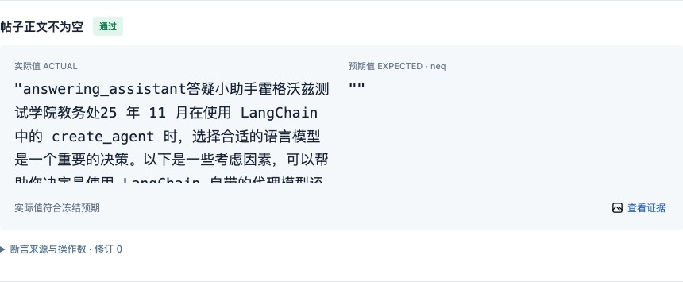

# User guide

[简体中文](使用说明.md) | English · [Project README](../../README.en.md) · [Installation](../deployment/安装与运维.en.md)

This guide describes version 0.10.0. Install the plugin in the DSH profile you run, configure a model, and set the plugin's workspace before entering commands. UI tests also need a dedicated Playwright MCP; API-only tests do not.

Install the Browscreen command on the DSH host, then open **Settings → 测试插件**, enable 浏览器实时预览, click 检测安装, select the capture port and dedicated Playwright MCP, and save. Advanced settings accept an absolute executable path when the default `browscreen` is unavailable. Use the normal test commands afterward. Saved changes apply on the next run; no extra prompt or separate service startup is required. Follow the [step-by-step setup guide (Chinese)](浏览器实时预览一步一步配置.md) for prerequisites, field examples and troubleshooting.

## Visual tour

Follow the flow from describing a task to reviewing its plan, watching progress, and reading the report. The execution screenshots below come from **real runs on version 0.9.1**, using the Chinese UI: search for `agent`, open the first community post, and check that its body is not empty. Website content, generated steps, and timings can vary.

- [Current step, elapsed time, full list, live browser, and settings](#browser-example).
- [Full plan and approval controls](#review-and-revise-a-plan).
- [Report results, actual values, expectations, and evidence](#reading-the-report-ui).

## Commands

Type these in the DSH conversation input:

| Command | Behavior |
| --- | --- |
| `/test <description>` | Plan in the current conversation, announce the plan, and execute without user confirmation |
| `/test-plan <description>` or `/test-plan --file <path>` | Review an inline task or TXT/Markdown cases before execution |
| `/test-run <file-path>` | Plan and announce TXT/Markdown cases, or execute a complete JSON suite |
| `/test-data <CSV-path> <template or --file path>` | Expand all parameter rows and review every instance before execution |

Only these four slash commands are registered. View status in the progress dock, stop with the native Stop button, rebuild reports from the completed-run UI or plugin settings, and handle quarantine and evidence files in plugin settings.

When selecting a command from the menu, enter its arguments before submitting. `/test-run` takes a TXT, Markdown, or JSON file path, not inline natural-language instructions. Input files and remediation evidence must resolve inside the configured plugin `workspace`; absolute paths outside it and symbolic-link escapes are rejected.

Ordinary conversations show no quarantine banner. If a test command is blocked by an unreleased environment, that conversation shows a notice directing you to **Settings → 测试插件 → 测试环境**. Confirm that old operations stopped, release the environment there, then submit the test again. Reading settings or dismissing the notice does not release resources. See the [recovery guide (Chinese)](测试环境卡住怎么办.md).

## File cases and CSV parameters

```text
/test-run examples/httpbin-cases.txt
/test-run examples/httpbin-cases.md
/test-plan --file examples/httpbin-cases.md
/test-data examples/httpbin-parameters.csv Request https://httpbin.org/get?keyword=${keyword} and verify status 200 and returned keyword ${keyword}.
/test-data examples/httpbin-parameters.csv --file examples/httpbin-parameterized.md
```

Run these separately. Files must be UTF-8; quote paths containing spaces. Each nonblank TXT line is one case. Each top-level ordered or unordered Markdown list item is one case; nested lists, tables, and code blocks remain inside it. Text outside root lists is shared context, not another case. Lists inside code blocks do not create cases. The included source files use Chinese descriptions; English cases work through the same format.

CSV's first record contains parameter names:

```csv
keyword,client
agent,dsh
testing,web
```

Every case uses every data row, in case-first order: 2 cases × 2 rows = 4 instances. `${keyword}` substitutes the matching column once; values containing another placeholder are not recursively expanded. CSV supports quoted commas, newlines, and escaped double quotes. Values retain leading zeroes, empty strings, and whitespace. Blank lines are skipped, but valid records with empty fields are retained. Missing template columns, duplicate/empty headers, mismatched column counts, or no data produce an error before starting the agent. Extra columns remain visible in review.

`/test-data` always enters native plan mode. Review shows the original command, file sources, source-case/data-row/instance counts, and each instance's original case, row, complete parameter mapping, expanded task, approach, steps, and checks. The model cannot omit or merge imported instances or rewrite CSV values. Request changes to revise the text plan; after editing a case file or CSV, cancel and resubmit because the current run uses the read snapshot.

Approval precedes target access. Instances execute sequentially in the same conversation; concrete operations and selectors remain runtime decisions. Report filters distinguish source cases and data rows. Expand “用例来源与参数” (case source and parameters) to compare the template, values, and expanded task. The downloaded plan retains the input snapshot; `input.json` is also saved in the run directory. Existing JSON suites remain compatible.

## Browser example

The panel emphasizes the current step above the composer and displays elapsed wall time including model and approval waits. “查看全部步骤（数量）” expands a bounded list with continuous batch numbering; click a row to inspect its text, checks, and reasons. The list's bottom action opens setup, cleanup, and full details in the native sidebar. The title's “测试进度” entry remains available during native review. Settled steps are not a pass rate. See the [progress guide (Chinese)](执行步骤与进度显示.md).

Here, step 3 is opening the first result. The first two steps are settled; total duration and the current step's duration are shown separately.


Expand “查看全部步骤” to see the full list. This screenshot shows a completed run with each step's name, status, and duration. Longer lists scroll within the panel.


The optional Browscreen floating preview opens only after the current page has usable CDP and a valid first frame. API-only and no-CDP tasks open no preview. Closing it does not stop the test or repeatedly reopen it; 显示实时画面 (show) reopens it, while 隐藏实时画面 (hide) closes it. Repeated clicks toggle visibility, with at most one preview window per conversation. The preview is read-only, closes when the run ends, and currently supports one active page. See [configuration (Chinese)](../deployment/安装与运维.md#浏览器实时预览可选).

This full-page screenshot shows the floating preview over the conversation, with execution records and the expanded step list still visible. The window shows the actual test page, with a frame number and capture time below it. Drag the title bar to move it or the bottom-right corner to resize it.


Configure the preview once in Settings → 测试插件 → 浏览器预览与录像. Enable it, detect the installed command, choose a browser, and save before running the normal test commands.


```text
/test Visit ceshiren.com, search for agent, open the first search-result post, and assert that the post's like count is not 0.
```

A typical text plan is:

1. Visit the community website.
2. Search for agent.
3. Open the first search-result post.
4. Read the post's like count and check that it is not 0.

The plugin presents the original task, a brief approach, and the steps before execution. It preserves the original request separately from later clarification. Planning does not visit the site or run API requests or shell commands. You do not need to supply selectors, output schemas, or comparators during planning.

The model determines concrete operations from the current page as it executes each step. It can correct a locator and retry a failed capture, but cannot overwrite a successful observation or change an expectation merely to obtain PASS. Numeric observations remain numeric: string `"1"` is not interchangeable with number `1`.

## Review and revise a plan

```text
/test-plan Send a GET request to https://httpbin.org/get?keyword=agent&client=dsh and verify HTTP status 200, returned keyword agent, and client dsh.
```

Use the host's native plan-review card:

1. Open the full plan and compare **Original task**, **Approach**, and **Steps**.
2. Choose **Request changes** and explain a correction in the conversation, or approve the draft.
3. After a revision, review and approve the new draft. Only the approved draft becomes the execution plan.

On a Chinese DSH interface, the relevant labels are “查看全文”, “要求修改”, and “同意执行”. Closing plan mode alone does not approve a test. Waiting for review does not consume the execution-step timeout. Cancelling before any business execution does not dispatch cleanup tools.

This is the actual full plan for the community example. Compare the original task with its approach, actions, and textual checks before approving it.


Then select “同意执行” to run, or “要求修改” to request a revision. Opening the full plan does not visit the target.


`/test-plan` requires the native `/plan` command, `exit_plan_mode`, and user review support in the current agent preset. The standard Web preset provides these. If a custom preset lacks them, the command reports an error. `/test` and `/test-run` retain their direct execution behavior.

## Follow progress in the conversation

A test can be the first message in a new conversation. DSH normally saves and names that conversation. Planning, tool calls, approval requests, questions, progress, and the final summary all use the originating agent's normal loop.

Completed tool calls may be collapsed. Expand them or use DSH's trace view to see details. A command acknowledgement only confirms that the task was submitted; it is not the test result. Testing constraints are removed after completion, so ordinary conversation can continue. Other conversations do not inherit the active test or its report.

For `/test`, the plugin observes the same conversation's native assistant messages and requires the full task/approach/steps announcement before execution tools can proceed. It asks the model to supply missing text rather than inserting a custom chat message or asking for approval.

## API-only tests

Run the included suite, with the plugin checkout configured as the workspace:

```text
/test-run examples/httpbin-get.json
```

The example sends one GET request to `https://httpbin.org/get?keyword=agent&client=dsh` and captures a single observation containing `{status, body}`. Three assertions check status `200`, echoed keyword `agent`, and client `dsh`. They reference fields in the same response rather than sending another request for each assertion.

This path does not initialize Playwright or create browser screenshots. Response evidence is included in the report. Current trusted API capture supports GET responses containing JSON; POST, custom bodies, and a general-purpose API client are outside the current implementation.

## Browser recording

Version 0.10.0 supports stable Browscreen `>=0.3.0,<0.4.0`. Install `browscreen[video]==0.3.0` on the DSH host with the uv command in the [recording guide (Chinese)](浏览器录像与报告.md). The `video` extra supplies PyAV; the settings installation check only confirms the CLI/version. Missing video dependencies produce a hint during the actual browser test.

Go to Settings → 测试插件 → 浏览器预览与录像, select 录制浏览器操作视频, choose the dedicated Playwright MCP, and save. Recording is independent of preview and off by default. Hiding the window or closing the DSH page does not stop recording, but the host must keep running. Each browser instance gets separate MP4 segments. In its report, choose 操作录像 to play, seek, or download; switching cases/tabs pauses playback. API-only reports and API instances in mixed suites contain no media area. Recording failures do not change business assertions.

MP4 files stay under the run directory’s `evidence/`; copy the whole run directory for offline playback. Rebuilt reports reuse the same archived videos without rerunning tests. Online video links are scoped to one file and expire after 24 hours or a host restart; reopen the authenticated report for fresh links.

## Actual steps and manual cases

New runs record concise browser operation explanations before native dispatch, along with real inputs and per-instance numbering. The report defaults to 实际步骤 when records exist. Download JSON or Markdown for the current instance or the full batch. Retries and failures remain; setup and business cleanup are separate, and automatic resets/closes are excluded. API cases record requests and checks without browser media. Missing intermediate expectations remain pending. Older reports retain their original step view. See the [detailed guide (Chinese)](实际步骤与手工用例.md). The JSON format is `dsh-actual-steps`, not an executable `/test-run` plan.

## Reports and saved records

The final response includes a clickable report link and its full local path. A typical directory is:

```text
artifacts/runs/<run-id>/
  plan.json
  events.jsonl
  results.json
  evidence/
  actual-steps.json
  manual-cases.md
  report.html
```

The configured `outputRoot` determines the actual location. Each rerun gets a new directory. The original textual plan stays in `plan.json`; runtime definitions are recorded separately in each instance's `effective_steps` and the event ledger.

The HTML is static and can be opened directly without a report service. The HTTP link uses the running DSH server and login protection. When DSH is stopped, that link is unavailable, but the local HTML remains usable. Copy the entire run directory when moving a report and its evidence. If accessing DSH through a remote proxy, use its actual origin with the same report path; generated links currently use the host's loopback address.

After a run ends, click 重建报告 (Rebuild report) in the progress dock or details, then 查看重建报告 (View rebuilt report). For historical runs, go to Settings → 测试插件 → 测试报告, enter the actual run ID from the report or output directory, and click 重建报告. Leave the ID blank to select only the currently selected conversation's report; this never falls back to another conversation's latest report. Active runs are rejected. Interrupted records can be rebuilt from saved facts and are clearly marked incomplete. Reconstruction writes `report-rebuilt.html`, `results-rebuilt.json`, `actual-steps-rebuilt.json` and `manual-cases-rebuilt.md` without overwriting original records. It does not rerun the test, invoke the model, or call business tools.

### Reading the report UI

The current report interface is primarily Chinese:

| UI label | Meaning |
| --- | --- |
| 概览 | Overview and status totals |
| 测试用例 | Cases, search, and filters |
| 实际步骤 | Numbered actual operations and checks; JSON and Markdown downloads |
| 步骤 | Setup, business, assertion, and cleanup steps |
| 断言 | Actual/expected values, operators, and assertion sources |
| 附件 / 查看证据 | Attachments / view the referenced evidence |
| 运行信息 | Run metadata and downloadable original data |
| 原始文字步骤与检查点 | Original text steps and checks |

Expand a step to inspect calls and capture adjustments. Screenshot previews and downloadable data are embedded in the HTML; original evidence files are also retained. Total run duration includes planning, while step duration sums step timings. Cancelled, blocked, or unexecuted work is not counted as passing.

The actual report below shows the run result at the top, case selection on the left, and recorded steps and checks on the right.


The nonempty-body check compares the captured content with an empty string using `neq`. “查看证据” opens its evidence, so the result can be checked against what was actually captured.



## Stop and clean up

Quarantine warnings appear only in conversations that attempt a test command. They direct the user to Settings → 测试插件 → 测试环境, which shows the reason, elapsed time and cleanup-timeout threshold. Use 处理并释放 to review the explanation; verify old external operations stopped, check the confirmation box, and select 确认关闭并释放. The native close tool still follows host policy and approvals. Failed or timed-out recovery retains quarantine, and elapsed time alone never clears it. Old results remain unchanged, and a successful recovery asks you to submit the test again. See the [recovery guide (Chinese)](测试环境卡住怎么办.md).

Use the native **Stop** button. New business actions stop first. Once in-flight operations settle, the same conversation performs only preauthorized cleanup and produces a cancelled or error outcome and a report. Stopping is not proof that an external operation has already finished.

If in-flight work cannot be confirmed settled, or required resource cleanup cannot be confirmed, the environment is quarantined. Restarting does not clear it. Verify that external operations stopped and reset the environment before submitting the evidence JSON in Settings → 测试插件 → 测试环境 → 高级处置：提交实际处置证据; follow the [remediation procedure](../deployment/安装与运维.en.md#stop-cleanup-and-quarantine). Do not delete the quarantine marker to bypass the check.

## JSON suites and assertion contracts

See [the browser suite](../../examples/ceshiren-agent.json) and [the API suite](../../examples/httpbin-get.json). Use JSON when concrete execution definitions are already known; natural-language planning does not require these fields.

- A suite contains cases; each case's datasets expand into separate instances. Empty datasets create a default row.
- Setup, business, and cleanup share a step structure. IDs are unique across a case's phases; the `__` prefix is reserved. Dependencies point to earlier steps.
- Each case needs at least one required business assertion. Required steps cannot depend on optional outputs.
- JSON actions declare targets, goals, inputs, output schemas, and required outputs. Capture is fixed by default; `capture_mode: "runtime"` permits runtime capture binding within the declared contract.
- Inputs may use `{"input_ref":"data.inputs.key"}`, `{"resource_ref":"browser_context"}`, `{"literal":value}`, or a direct JSON value. The current resource registry supports exclusive browser contexts.

| Capture kind | Meaning |
| --- | --- |
| `dom` | Fixed read-only DOM extraction using a selector and mode; require a unique match unless an explicit zero-based index is supplied |
| `http` | GET JSON response through the native tool pipeline; use paths such as `body.amount` |
| `browser_close` | Close the Playwright context and record `released=true` only after a successful tool response |

DOM modes are `text`, `number`, `count`, `visible`, `url`, `attribute`, and `value`. URL extraction defaults to the full URL; `field: "pathname"` selects the path. Numeric extraction does not turn a missing or blank value into zero. Captured observations are bound once and cannot be overwritten.

Assertions support `eq`, `neq`, `contains`, `range`, `exists`, `text`, and `visible`. Choose exactly one expected-value source: a literal, a dataset expectation, or another observation; supply a rule source in `source_refs`. Ranges require two numeric bounds, a unit, and tolerance. Required missing evidence causes ERROR; optional missing evidence can make the relevant assertion INCONCLUSIVE.

The model may append checks supported by existing rule sources to future boundaries of unfinished instances. Required additions can affect those instances' outcomes. Existing steps, expectations, and finished outcomes are not rewritten. Adding new authority, business writes, or broader permissions requires a new confirmed plan.

## Language and limitations

Explanations, brief analysis summaries, progress, questions, and final responses follow explicit DSH `locale.preference`. If it is absent, a task containing Chinese falls back to Chinese; otherwise English is used. URLs, code, field names, original input, and raw responses remain unchanged. The plugin does not change host settings or rewrite conversation history. Report labels and some plugin-generated messages remain Chinese.

At runtime, ordinary scalar expectations use plain text such as `agent`, `200`, or `0`; complex objects or arrays use JSON. Types follow explicit numeric conditions and trusted observations. Simple numeric wording has extra validation, but the plugin does not prove the semantics of arbitrary natural language. Review plans and evidence for important cases.

All test execution, including JSON suites, still uses the model loop. Deterministic assertions and model-free report reconstruction do not constitute model-free replay of the test actions.

The progress panel highlights the current action, resolved business steps, total time, and step time. Use 查看全部步骤 to open the bounded full list, select a row for details, or collapse the panel. Long current-step text can be expanded. Multi-instance numbering is continuous; setup and cleanup keep separate labels. See the [progress guide (Chinese)](执行步骤与进度显示.md).
