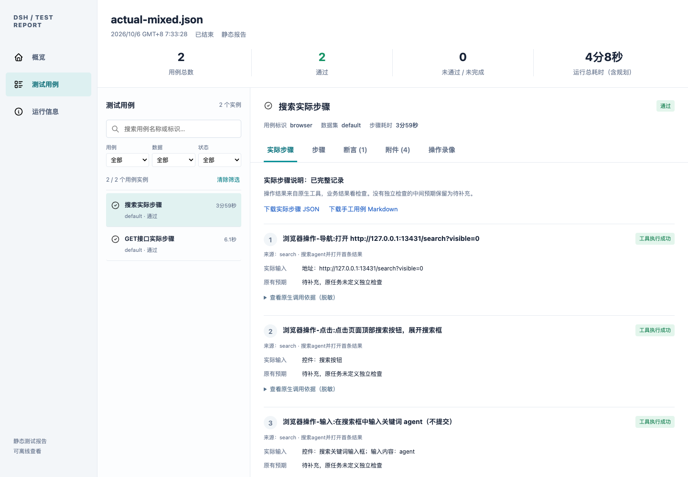

# 实际步骤与手工用例

实际步骤记录自 0.11.0 提供；0.11.1 将手工用例调整为供其他人再次执行的简洁模板。安装与升级见[安装与运维](../deployment/安装与运维.md)。

## 1. 运行报告与手工用例分别做什么

运行报告回答“这次做了什么、结果如何”：保存操作说明、真实调用、检查、成功失败、重试、未知结果和证据。实际步骤记录也属于这类运行资料，交给下一位执行人时使用 Markdown 手工用例。

手工用例回答“下一位执行人要做什么”：只包含用例名称、原始用例、前置用例、实际步骤、收尾。每个步骤只给序号、操作步骤、预期结果；本轮实际值、状态、证据、耗时、实例 ID、参数快照和来源标识不写入这个模板。

输入框上方的进度按原规划计数；报告内的实际操作会将一个规划步骤展开为若干动作。例如规划里的“搜索 agent”，实际可能是点击搜索、输入 agent、按 Enter 三步。



截图保留 0.11.0 实施阶段的报告效果；0.11.2 的 Markdown 内容使用下一节格式。

## 2. 手工用例长什么样

下面使用虚构的 qa_user_1 和 demo-only-password 展示格式，不是真实账号。

```markdown
# 用例名称：登录并搜索

## 原始用例

访问测试站点，用测试账号登录，搜索 agent，确认结果不为空。

## 前置用例

| 序号 | 操作步骤 | 预期结果 |
| --- | --- | --- |
| 1 | 访问 http://localhost:13431/sign_in |  |
| 2 | 在用户名框中输入「qa_user_1」 |  |
| 3 | 在密码框中输入「demo-only-password」 |  |
| 4 | 点击登录按钮 |  |

## 实际步骤

| 序号 | 操作步骤 | 预期结果 |
| --- | --- | --- |
| 1 | 点击搜索按钮 |  |
| 2 | 在搜索框中输入「agent」 |  |
| 3 | 按 Enter 提交搜索 |  |
| 4 | 检查搜索结果数量 | 不等于 0 |

## 收尾

| 序号 | 操作步骤 | 预期结果 |
| --- | --- | --- |
| 1 | 退出登录 |  |
```

地址和输入内容放在操作句子中，不另列“实际输入”。原任务没有定义独立预期时留空，不显示“待补充”，也不根据这次页面成功反推预期。已有检查保留冻结的预期，用“等于”“不等于”等文字表达。

前置、实际步骤和收尾各自从 1 编号。已确认成功的动作用于模板；失败尝试、未派发和未知操作在运行报告里查看，不要求下一位执行人重做。已执行的业务检查即使本轮 FAIL，也保留其原有预期。自动浏览器初始化/复位不写成业务步骤；用户声明的前置条件和业务收尾继续保留。

多行输入用 \n 表示换行，并在操作中说明。Markdown 使用普通字符与必要的反斜杠转义，不生成 &#95;、&#42; 等 HTML 实体。

## 3. 原始用例从哪里来

| 输入方式 | “原始用例”内容 |
| --- | --- |
| /test 或 /test-plan 自然语言 | 用户最初提供的那段任务描述 |
| TXT、Markdown 用例文件 | 该条用例的原始文字，不拼入规划分析或系统执行说明 |
| CSV 参数化 | 用户原始模板，保留 ${参数名}；具体实例的真实输入写在操作步骤中 |

## 4. 怎样下载和使用

1. 等测试结束，打开“查看测试报告”。
2. 在左侧选择用例和数据实例。
3. 在“实际步骤”上方点击“下载手工用例 Markdown”，保存当前实例。
4. 要下载全部用例，在概览或运行信息里点击“下载完整批次手工用例”。
5. 打开 .md 文件，交给执行人或复制到自己的测试用例库；执行结果由下一次手工测试另外记录。

手工文件包含本用例执行需要的真实账号、输入和地址，不脱敏。保存目录继续是本机运行输出目录，不提交 Git。运行账本、实际步骤 JSON 和报告内容继续沿用现有脱敏规则；HTML 使用独立手工文件的下载链接，不内嵌未脱敏的手工正文。

## 5. 文件、离线保存与重建

```text
run-…/
  plan.json
  results.json
  events.jsonl
  checkpoints/
  manual-source.json         # 手工用例专用原文、输入及预期，权限 600
  actual-steps.json          # 运行记录 JSON
  manual-cases.md            # 完整批次手工模板
  manual-cases-1.md          # 第一个实例的手工模板
  manual-cases-2.md          # 第二个实例；其余依次编号
  report.html
  evidence/
```

manual-source.json 是手工生成资料，不是运行结果，也不通过报告下载路由开放。新的手工文件同样使用 600 权限。在线下载由已认证报告签发准确文件的 GET/HEAD 票据；不是所有 JSON 或其他文件都可用该票据访问。

离线时复制整个运行目录，再打开 report.html。单独复制 HTML 仍可查看运行结论、步骤和内嵌证据；手工用例下载、事件账本和 MP4 回看需要对应独立文件。

需要重新生成时，在已结束运行的进度区点击“重建报告”，或到“设置 → 测试插件 → 测试报告”填写运行 ID。重建读取原账本和 manual-source.json，生成 actual-steps-rebuilt.json、manual-cases-rebuilt.md、manual-cases-1-rebuilt.md 等，以及 report-rebuilt.html；原文件不覆盖，不请求模型、不打开被测页面、不重新执行。

0.11.0 及更早运行没有保存这种原始手工资料。重建可以使用已经保存的说明生成新格式，但无法恢复已被脱敏的值，也不会从当前网页或已经变化的外部数据猜测。要得到完整真实数据，升级后使用原用例重新运行。未执行的业务步骤不会凭空补入模板；不完整运行的缺失步骤由用例维护者根据原需求补充。

## 6. 常见问题

| 现象 | 处理 |
| --- | --- |
| Markdown 仍是旧格式 | 升级到 0.11.2，重启同一 profile、刷新页面，再运行或重建报告 |
| JSON 里仍有状态、输入、来源等信息 | 下载的是“实际步骤 JSON”，用于运行记录；交给其他人执行请用“手工用例 Markdown” |
| 原始用例为空 | 原始来源没有独立文字描述时留空；不要把自动规划当成用户原始需求 |
| 某步骤预期为空 | 原任务没有独立定义该预期，按需由用例作者补充 |
| 旧记录仍有 [已脱敏] | 旧运行没有保存原始值，不能还原；新版本重新运行后生成真实数据 |
| 手工文件丢失 | 保留完整运行目录及 manual-source.json，通过界面重建；原始资料也丢失时无法恢复丢失的值 |
| 原始资料无效或不属于本次运行 | 保留原件，核对是否误混其他运行文件；不更改运行 ID 绕过检查 |

运行状态、失败与恢复规则见[当前实现](../architecture/当前实现.md)和[故障速查](../deployment/常见问题速查与处理.md)。
