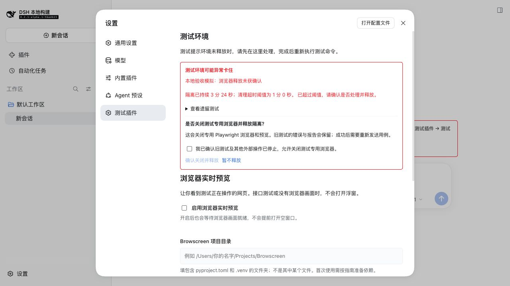

# 测试环境卡住怎么办

适用于当前开发版本（命令精简与界面处置更新）；隔离提示自 0.8.2 起提供。环境隔离表示旧测试的外部操作或资源没有确认释放，不表示新测试已经开始执行。

释放失败、工具不可用或需要手工清理时，查看[常见问题速查与处理](../deployment/常见问题速查与处理.md#f03-释放失败或不可用)；其中包含外部资源检查、处置文件填写与设置页证据提交操作。

## 你会看到什么

只是安装插件、打开普通对话时，不会出现环境隔离提示。你不用这个插件，就不会被它的隔离提醒打扰。

当你发送 `/test` 等测试命令，插件发现环境还没有释放，就会在**你刚刚使用的那个对话**中说明原因，并告诉你：“请进入 设置 → 测试插件 → 测试环境，先处理并释放，再重新执行测试命令。”这次测试没有开始。其他没有发送测试命令的对话不会出现这条提醒；关闭提示也不会释放环境。

点击 DSH 的“设置”，再点击左侧“测试插件”。页面上方是“测试环境”，显示原因、隔离持续时间和清理超时阈值，还可以展开查看遗留测试的运行编号。环境正常时显示“测试环境已就绪，无需释放”。只有进入这个设置页才会查询隔离状态。

超过 `cleanupTimeoutMs` 后，标题变成“测试环境可能异常卡住”，并提示确认是否处理释放。该配置默认 60000 毫秒，也就是 1 分钟。时间从隔离记录的 `created_at` 开始计算，同一遗留运行在重启后再次被识别，不会重新开始计时。

时间超限用于提醒，浏览器是否关闭仍需要确认。页面读取提示不会关闭浏览器、解除隔离、重放旧测试或启动实时画面浮窗。

## 怎样主动释放

1. 先确认旧测试和其他外部操作已经停止，当前专用浏览器没有其他正在执行的任务。
2. 打开“设置 → 测试插件”，找到页面上方的“测试环境”，点击“处理并释放”。
3. 阅读说明，勾选“我已确认旧测试及其他外部操作已停止，允许关闭测试专用浏览器”。按钮初始不可点击，勾选后才能继续。
4. 点击“确认关闭并释放”。若不想处理，点击“暂不释放”，隔离会保留。
5. 插件通过 DSH 原生工具尝试关闭测试专用 Playwright 浏览器。宿主要求审批时，按实际意图处理审批。
6. 浏览器关闭成功且本插件的预览停止后，保存 `release-*.json` 处置记录，再解除该条隔离。
7. 页面显示“测试环境已释放”，关闭设置，回到对话，再重新发送原来的 `/test` 命令。插件不会自动重新执行旧任务。

如果页面提示“请先打开一个对话”，先关闭设置，打开任意一个正常对话，再回到这里操作。释放使用这个对话的原生工具链，宿主才能按原有方式展示工具审批。

旧测试的错误、报告和资源账本保持原样；主动释放记录表示后续已经处置，不会将旧测试改成 PASS。

下面是隔离验收环境中的确认界面；“本地验收模拟”说明它是演示夹具。未勾选确认时，“确认关闭并释放”按钮不可用。

## 处理失败怎么办

| 页面提示或情况 | 说明与下一步 |
| --- | --- |
| 当前测试尚未结束 | 先停止测试并等待收尾；活动测试或释放期间不能再次解除隔离 |
| 没有可用的 Playwright 关闭工具 | 检查专用 MCP 是否正常连接，然后重试；也可完成实际外部处置后在设置页提交实际处置证据 |
| 浏览器关闭未成功 | 可能审批被拒绝或 MCP 连接失败；隔离保留，查清原因后重试 |
| 释放操作超时 | 未在清理超时期限内确认完成；页面立即说明失败，但在途关闭操作结算前仍保持互斥，避免重复派发 |
| 隔离状态已变化 | 确认页面展示的记录与当前记录不同；重新查看并确认，不会用旧确认删除新隔离 |
| 隔离记录或时间异常 | 无法可靠计算持续时间，需人工核查记录与实际资源 |
| 未能确认浏览器资源归属 | 可能缺少运行记录，或涉及 API、App 等其他资源；自动浏览器恢复不适用，先核实外部环境，再提交实际处置证据 |

需要手工处置时：按[停止与隔离处置](../deployment/安装与运维.md#停止与隔离处置)准备真实的 JSON 证据，进入“设置 → 测试插件 → 测试环境”，展开“高级处置：提交实际处置证据”，填写工作区内的文件路径，勾选实际处置确认，再点击“提交证据并解除隔离”。文件校验或隔离状态校验失败时会保留隔离。

界面会提交当前隔离编号；确认期间记录变化时，需重新阅读并勾选，旧确认不会删除新的隔离。查看状态、停止、报告重建、异常处置均通过界面操作，斜杠命令只保留 `/test`、`/test-plan`、`/test-run`、`/test-data`。

## 升级后看不到新提示

确认安装的是 0.8.2 或更新版本，并正常重启同一 Web profile 的 DSH，刷新页面。新对话默认没有提示，这是预期行为；可进入“设置 → 测试插件”查看环境，或在测试命令被阻塞时查看该对话的提示。构建源代码不会自动替换正在运行的安装包。具体更新步骤见[安装与运维](../deployment/安装与运维.md#构建与打包)。升级保留原有隔离标记，需要你确认后才会释放。
