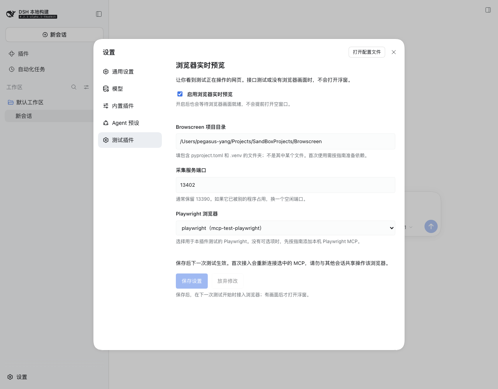

# 浏览器实时预览一步一步配置

[项目首页](../../README.md) · [使用说明](使用说明.md) · [安装与运维](../deployment/安装与运维.md)

本文适用于插件 **0.8.0 及以上版本**。按顺序操作即可，不需要在测试任务中加“打开预览”之类的提示词。只想做接口测试，可以跳过整篇文章，预览默认关闭。

## 1. 先认识这三个名字

| 名字 | 它负责什么 | 你平时要做什么 |
| --- | --- | --- |
| DSH（DeepSeek Harness） | 显示对话、设置、执行步骤和测试报告 | 在它的输入框输入测试命令 |
| Playwright MCP | 真正打开网页、输入文字、点击按钮 | 首次安装时把它接到 DSH，以后由测试调用 |
| Browscreen | 拍下测试浏览器当前的页面，并提供连续画面 | 首次准备好项目和依赖，以后插件自动启动它 |

“无头模式”表示测试浏览器没有独立窗口，不表示它没有网页。这个功能让你在 DSH 浮窗里看到它正在显示什么。

“CDP”是浏览器提供的调试连接。插件要拿到这条连接才能让 Browscreen 拍画面。你不需要查找或填写 CDP 地址，插件会在选中的 Playwright MCP 创建页面时交付真实地址。

采集服务端口由你填写，浏览器 CDP 端口则由系统自动分配。两者是不同的数字，不要把它们混在一起。项目锁定的 MCP 0.0.68 和本机原有 0.0.80 都已验证能够交付 CDP 和连续画面。

## 2. 第一次使用前，准备好东西

### 2.1 安装或升级测试插件

如果已经安装 0.8.0，可以跳到下一步。如果还是 0.7.0，先按[安装与运维](../deployment/安装与运维.md#构建与打包)构建安装包，再安装到你实际使用的 Web profile。

升级完成后，正常停止旧 DSH 服务，重新启动同一个 Web profile，再刷新网页。安装包更新不会让已经运行的旧进程自动变成新版本；不用删除旧会话。

你看到“设置”中的“测试插件”页面，才说明这份前端已经加载。如果没有看到，请看本文第 7 节。

### 2.2 准备 Browscreen

你需要知道 Browscreen 项目文件夹在哪里。本机示例是：

```text
/Users/pegasus-yang/Projects/SandBoxProjects/Browscreen
```

打开这个文件夹，应该能看到 `pyproject.toml`。它是项目目录，不是一个图片、不是 `main.py`，也不是 `src` 文件夹。

插件不会在测试途中下载和安装 Python 依赖。第一次需要准备 `.venv`。在终端分别运行下面两行；如果你的目录不同，就把第一行换成你的目录：

```sh
cd /Users/pegasus-yang/Projects/SandBoxProjects/Browscreen
uv sync -i http://mirrors.aliyun.com/pypi/simple/ --trusted-host mirrors.aliyun.com
```

当前 Browscreen 项目要求 Python 3.14 或更高版本，以项目自己的 `pyproject.toml` 为准。`uv sync` 会按项目配置准备环境；如果提示 Python 版本不够，请先用 uv 准备符合要求的 Python，再重新执行。

成功后，项目里应有 `.venv` 文件夹。后续 DSH 启动采集时使用 `uv run --no-sync`，只使用已准备的依赖。

如果终端提示 `uv: command not found`，先按 uv 的安装说明安装 uv。启动 DSH 的终端也必须能执行 `uv --version`。在另一个终端能找到 uv，不代表一个已经运行的旧 DSH 进程拥有更新后的 PATH；必要时正常重启 DSH。

### 2.3 确认 DSH 已有 Playwright MCP

如果你原本已经能执行网页用例，通常已经具备这一项。到下一节的“Playwright 浏览器”下拉框查看，存在可选项就继续。

如果下拉框只有“请选择浏览器”，需要先[注册 Playwright MCP](../deployment/安装与运维.md#通过设置页启用预览推荐)。这是首次安装步骤，不是每次测试都要做的事。

当前自动接入支持本机 `stdio` 模式、`serverName: playwright`、由 MCP 启动的 Chromium 浏览器。远程 HTTP MCP、扩展模式、连接外部浏览器的 `--cdp-endpoint` 不在本次自动配置范围内。

使用一个专门供测试插件操作的浏览器。首次接入会重新连接选中的 MCP，不要同时在其他会话中使用它。

## 3. 在页面里填写设置

1. 打开你平时使用的 DSH 网页并登录。
2. 点击左侧底部的“设置”。
3. 在设置窗口左侧点击“测试插件”。
4. 找到“浏览器实时预览”区域；0.8.2 的页面上方还有“测试环境”区域，用于查看隔离及释放状态。
5. 勾选“启用浏览器实时预览”。
6. 在“Browscreen 项目目录”中粘贴上一节的完整目录。
7. “采集服务端口”通常保留 `13390`。
8. 在“Playwright 浏览器”下拉框中，选择你用于测试的 `playwright`。
9. 点击“保存设置”。
10. 看到“已保存。下一次 /test 或 /test-plan 会使用这些设置，无需重启 DSH。”后，关闭设置窗口。

没有点击“保存设置”，填写的文字还只是草稿。“放弃修改”会恢复已经保存的值。

下面是真实 DSH 设置页的例子。截图中验收环境使用 `13402` 和 `mcp-test-playwright`；你可以使用默认空闲端口 `13390`，并选择自己实际注册的浏览器。



### 每个框到底填什么

| 页面字段 | 本机示例 | 要注意什么 |
| --- | --- | --- |
| 启用浏览器实时预览 | 勾选 | 取消勾选并保存后，下一次测试不启用预览 |
| Browscreen 项目目录 | `/Users/pegasus-yang/Projects/SandBoxProjects/Browscreen` | 用完整路径；应同时具备 `pyproject.toml` 和准备好的 `.venv` |
| 采集服务端口 | `13390` | 这是 Browscreen 的端口，不是 DSH 网页端口，也不是 CDP 端口 |
| Playwright 浏览器 | `playwright（mcp-playwright）` | 括号中是 DSH 注册实例的名字；开发验证环境可能叫 `mcp-test-playwright` |

不同电脑的目录、实例名称和空闲端口可能不同。不要照抄一个不存在的目录；端口需要是 1 到 65535 之间的整数。

你无需填写共享目录、`.cdp` 文件、初始化脚本或环境变量。这些由插件准备。

## 4. 运行第一条用例

打开一个空闲会话，在普通对话输入框粘贴：

```text
/test 访问ceshiren.com，搜索 python测试开发，打开第一条搜索结果，断言该帖子的正文不为空
```

按回车提交。命令前面的 `/test` 也要一起输入，不能只输入后面的自然语言。

你会依次看到：

1. 插件分析任务，并列出业务步骤。
2. 步骤图提示正在进行哪一步，以及已花费的时间。
3. Playwright 真正创建浏览器页面。
4. 插件取得该页面的 CDP，并按需启动 Browscreen。
5. Browscreen 提供第一张有效画面后，出现“浏览器实时画面”浮窗。
6. 画面继续更新，直到浏览器资源释放或测试结束。
7. 测试结束后浮窗自动关闭，插件释放自己启动的采集服务；报告仍可查看。

刚提交时没有浮窗是正常的。规划还没有打开浏览器，就没有可拍的页面；插件会等待，不会先放一个空框出来。

网站内容、搜索结果和模型执行时间都可能变化。预览能显示页面，不代表业务断言一定成功；用例是否通过，以插件结果和报告为准。

### 想先看计划，再让它操作

将命令换成：

```text
/test-plan 访问ceshiren.com，搜索 python测试开发，打开第一条搜索结果，断言该帖子的正文不为空
```

先阅读计划，确认后批准。没有批准之前不会执行网页动作，通常也不会产生预览画面。

`/test-run` 和 `/test-data` 启动的测试也会在下次开始时读取相同的预览设置。

## 5. 浮窗怎么使用

浮窗只展示画面，网页操作仍由测试执行。不要把它当成可点击操作的第二个浏览器。

可以使用 DSH 浮窗自身的移动、调整大小和关闭功能。关闭预览不会关闭测试浏览器，也不会停止测试。本轮手动关闭后不会反复弹出；有有效画面时，可通过测试进度中的“实时画面”入口再次打开。

预览只属于正在显示的测试会话。切到其他会话时，不会把另一条测试的页面误当成当前画面。

当前只支持一个活动页面。出现多个浏览器标签时，预览会停用，避免显示错误目标；首版不会自动跟随新标签。请让用例在同一标签里打开结果，或按实际测试需求正常关闭不用的标签。

## 6. 下次使用要不要重新配置

不用。保存的字段留在当前 Web profile 中，刷新网页或正常重启 DSH 后仍会保留。

下一次继续输入 `/test` 即可。不用另开终端启动 Browscreen，也不用在任务里加“打开浮窗”。

如果改了目录、端口或选中的 MCP，点击保存后，从下一次测试开始生效。当前正在运行的测试继续使用启动时的配置。

如果不想显示画面：打开“设置 → 测试插件”，取消“启用浏览器实时预览”，点击“保存设置”。它不会立即关闭当前运行使用的浏览器；下一次测试不会开启预览。

## 7. 看不到浮窗时，按顺序检查

| 你看到什么 | 为什么可能这样 | 下一步做什么 |
| --- | --- | --- |
| 设置里没有“测试插件” | 插件版本旧、宿主尚未重启、网页还是旧代码 | 安装 0.8.0 后重启同一 Web profile，并刷新网页 |
| 提示当前连接不能保存宿主设置 | 非本机连接被宿主限制，或缺少设置服务 | 从宿主的本机访问地址打开；自定义部署检查 settings 和 config-editor |
| 下拉框没有可选的 Playwright | MCP 未注册，或接入类型不支持 | 按安装指南注册本机 stdio Playwright MCP，使用 Chromium |
| 提示没有保存成功、被 patch 覆盖 | 启动参数用高优先级 patch 固定了插件或 MCP 配置 | 把相关配置移到可编辑的 Web profile，正常重启；不要继续叠加固定配置的命令行 patch |
| 提示目录错误 | 填了相对路径、子目录或不存在的目录 | 找到含 `pyproject.toml` 的 Browscreen 文件夹，复制它的完整路径 |
| 提示尚未准备 `.venv` | Python 依赖还没准备 | 在 Browscreen 目录执行本文第 2.2 节的 `uv sync` |
| 已保存，但仍在规划或等待批准 | 还没有实际浏览器页面 | 等待执行网页步骤，或先批准计划 |
| 运行接口测试、App 测试 | 没有可用的当前页面 CDP | 无需处理，这类任务按要求不显示空浮窗；本功能没有新增 App 执行适配器 |
| 浏览器已打开，但没有画面 | CDP 未交付、uv 不可用、采集启动失败、端口占用或没有有效首帧 | 在设置页和测试进度查看原因；核对 uv、目录与端口，再在下一次测试验证 |
| 打开了多个标签 | 首版不自动选择多个页面中的目标 | 按用例需求保持一个活动页面，再验证 |
| 测试已结束后没有浮窗 | 实时预览已经释放 | 查看报告里的截图；历史运行不会重新启动浏览器补开实时画面 |
| 提示共享环境处于隔离状态 | 上一次测试存在未结算动作或清理问题 | 在“设置 → 测试插件 → 测试环境”确认并释放，详见[环境残留处理](../deployment/常见问题速查与处理.md#f01-环境未释放)；启用预览不会解除隔离 |

改完设置后仍看不到画面，不要为了显示浮窗去猜一个 CDP 端口，也不要删除隔离标记。预览异常只影响展示，不会把失败的业务断言改成通过。

## 8. 给维护者看的补充

设置字段保存为 `harness-test` 条目的 `browserPreview`，普通安装的文件位置是 `~/.dsh/profiles/web/cordis.patch.yml`；自定义 `DSH_HOME` 时位置随 home 改变。

插件使用 DSH 的 volatile 配置引用保存偏好，不重载正在执行的测试插件。在下一次测试开始前，校验选中的 MCP，通过宿主 `configEditor` 更新它的参数和环境变量。JSON 浏览器配置、已有初始化脚本、CLI 参数与环境变量会被保留，只补充本插件需要的接入。

生成的配置位于 `outputRoot/.browser-preview/<插件实例ID>/`。MCP 的 `DSH_TEST_PREVIEW_DIR` 指向相同目录；真正出现当前测试页面时才写入页面归属和 CDP。Browscreen 依然在 CDP 可达后按需启动，浮窗仍要求有效首帧。

旧的 `preview` 手动配置继续支持。尚未保存新的 `browserPreview` 时沿用旧配置；一旦在设置页保存，新的设置优先，包括明确关闭。若旧值由命令行 overlay 固定，先处理 overlay 的优先级，再使用设置页。
