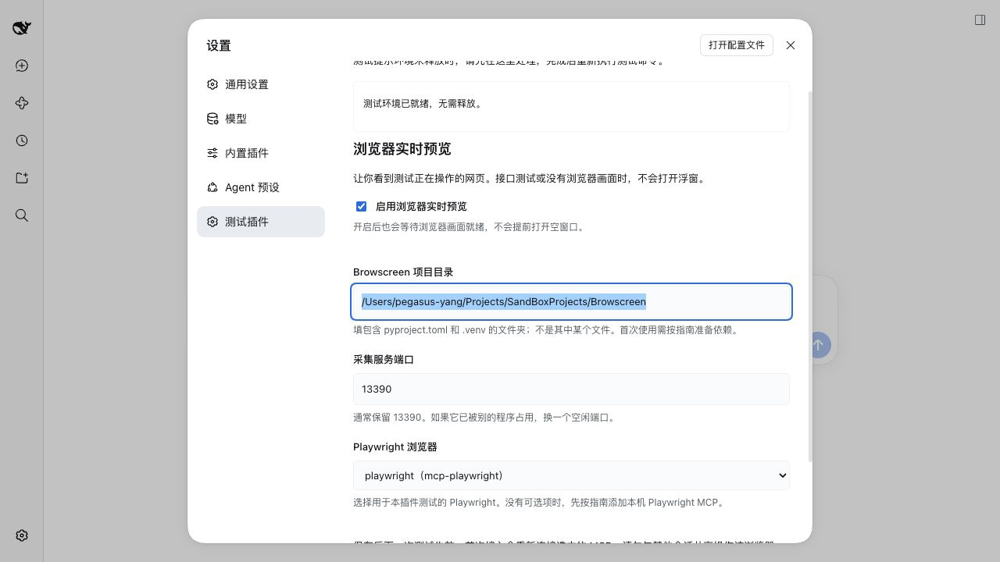

# 浏览器实时预览一步一步配置

[项目首页](../../README.md) · [使用说明](使用说明.md) · [安装与运维](../deployment/安装与运维.md)

本文对应插件 **0.9.2 的本机命令方式**。先从[GitHub 地址安装测试插件](../deployment/安装与运维.md#从-github-安装与卸载)，再安装 Browscreen，到设置页开启预览；以后直接输入 `/test`。不用下载插件或 Browscreen 源码，不用提前启动采集服务，也不用在任务中加“打开预览”。只做接口测试时可以跳过，预览默认关闭。

## 1. 先认识这三个名字

| 名字 | 它负责什么 | 你要做什么 |
| --- | --- | --- |
| DSH（DeepSeek Harness） | 显示对话、设置、步骤和报告 | 在输入框发送测试命令 |
| Playwright MCP | 打开网页、输入和点击 | 首次接入一个兼容的测试浏览器 |
| Browscreen | 拍下测试浏览器正在显示的页面 | 安装一次，之后由插件按需启动 |

“无头模式”表示浏览器没有独立窗口，它仍然有网页。实时浮窗让你看到这个网页，但网页操作仍由测试执行。

“CDP”是浏览器提供的调试连接。插件从当前 Playwright 页面取得真实地址，你不用寻找或填写它。Browscreen 的采集端口由设置决定，浏览器的 CDP 端口由系统分配，它们是两回事。

## 2. 第一次使用，先安装

### 2.1 安装测试插件

按[构建与打包](../deployment/安装与运维.md#构建与打包)安装包含 0.9.0 新功能的插件。更新安装包后正常重启同一个 DSH Web profile，再刷新网页，让服务和网页加载新代码。

在“设置”中能看到“测试插件”，并且预览区域有“检测安装”按钮，说明新界面已加载。

### 2.2 安装 Browscreen 命令

打开 **运行 DSH 的那台电脑**的终端。使用 uv 创建独立的工具环境并安装：

```sh
uv tool install --python 3.14 'browscreen==0.2.1' \
  -i http://mirrors.aliyun.com/pypi/simple/ \
  --trusted-host mirrors.aliyun.com
browscreen version
```

看到 `browscreen 0.2.1`，就像点名时它回答“我在这里”，说明终端找到了命令。当前插件支持稳定版本 `>=0.2.1,<0.3.0`，验收基线为 0.2.1；新版本需要符合此范围，不使用预发布版。

注意：

- 提示 `uv: command not found` 时，先按 [uv 官方安装说明](https://docs.astral.sh/uv/getting-started/installation/)安装 uv，再执行上面的命令。
- Browscreen 要求 Python ≥3.14。需要准备解释器时，先执行 `uv python install 3.14`。
- 镜像暂未同步 0.2.1 时，可从 [PyPI 0.2.1 发布页](https://pypi.org/project/browscreen/0.2.1/#files)下载 wheel，在 `uv tool install` 中用实际 wheel 文件路径替换包名；第三方依赖仍使用上述镜像参数。
- 若已用其他环境安装，插件也可以直接调用其中的完整 `browscreen` 可执行文件路径。

不用在插件项目中创建 Python 环境。插件也不会在运行测试时自动下载或升级 Browscreen。

### 2.3 命令找不到时，找到它的完整地址

安装成功但提示 `browscreen: command not found`，或者终端能运行、DSH 检测却找不到时，执行：

```sh
uv tool dir --bin
```

这个命令会打印一个文件夹地址。把地址复制下来，在后面加 `/browscreen`，得到可执行文件的完整路径。例如输出 `/完整路径/bin`，你要填写 `/完整路径/bin/browscreen`。

如果终端已经能运行，也可以执行 `command -v browscreen` 复制命令位置。**不要照抄示例占位路径，要复制自己电脑的实际输出。** 使用完整路径可以避免 DSH 的 PATH 与终端不一致；不会要求 DSH 去读取你的 shell 配置。

如果网页连接的是另一台电脑上的 DSH，包要安装在那台宿主电脑上，路径也要填宿主电脑上的路径。

### 2.4 确认已经有 Playwright MCP

已经能执行网页用例时，通常可以复用已有实例。没有可选浏览器时，按[首次注册一个可编辑的 MCP](../deployment/安装与运维.md#首次注册一个可编辑的-mcp)添加。

当前自动接入支持本机 `stdio`、`serverName: playwright`、由 MCP 启动的 Chromium。远程 HTTP MCP、扩展模式、连接外部浏览器的 `--cdp-endpoint` 不属于此自动接入方式。

选择专门供本插件测试的浏览器。首次接入可能重新连接该 MCP，不要在其他会话同时操作它。

## 3. 进入设置，检测并保存

1. 打开并登录你使用的 DSH 网页。
2. 点击左侧底部“设置”，再点“测试插件”。
3. 找到“浏览器实时预览”，勾选“启用浏览器实时预览”。
4. 默认使用 `browscreen`。若需要完整路径，展开“高级设置：Browscreen 命令路径”，把上一节找到的地址填入“Browscreen 可执行文件”。
5. 点击“检测安装”。等它显示 `Browscreen 0.2.1 已安装，可以使用。`，核对下面的命令位置和版本。
6. “采集服务端口”通常保留 `13390`；如果被其他程序占用，改成一个空闲端口。
7. 在“Playwright 浏览器”中选择用于测试的实例。
8. 点击“保存设置”，看到“已保存”后关闭设置。

**检测安装只检查你填写的命令，不保存，也不启动浏览器或采集服务。** 检测成功后仍要点击保存。修改命令路径会清除旧检测结果；“放弃修改”恢复已经保存的配置。



| 页面字段 | 通常怎么填 | 它的意思 |
| --- | --- | --- |
| 启用浏览器实时预览 | 勾选 | 允许下一次测试按需显示画面 |
| Browscreen 可执行文件 | 默认 `browscreen` | 程序本身的命令名或完整路径，不是项目文件夹 |
| 采集服务端口 | `13390` | Browscreen 的监听端口，不是 DSH 网页或 CDP 端口 |
| Playwright 浏览器 | 选择已注册的 `playwright` | 插件从这个浏览器取得当前测试的 CDP |

命令路径可以有空格，但不能填写 `uv run browscreen` 或 `browscreen --port 8000`。插件会自己添加启动参数。完整路径不要使用 `~` 或 `$HOME` 缩写。端口填写 1 到 65535 的整数。

工作目录、初始化脚本和 `.cdp` 文件由插件准备，不需要在设置页填写。

需要指定完整路径时，展开高级设置。下面展示默认命令；将它替换为你找到的完整入口路径即可：


## 4. 执行第一条用例

打开空闲会话，在输入框粘贴完整命令并按回车：

```text
/test 访问ceshiren.com，搜索 python测试开发，打开第一条搜索结果，断言该帖子的正文不为空
```

你会依次看到：规划步骤、执行进度和耗时、浏览器页面，以及有画面后自动出现的浮窗。测试结束时，插件关闭浮窗并停止自己启动的采集服务，报告仍然可以查看。

下面是 **0.9.1 实际执行社区搜索用例**时的完整 DSH 页面，该用例搜索 `agent`。截图处于访问社区首页的步骤：左上方显示浏览器实时画面，对话区保留执行记录，下方展开步骤进度和耗时。浮窗底部显示当前帧编号、采集时间和“只读预览”。


刚提交时没有浮窗是正常的：还在规划就没有实际页面；即使页面已创建，也要等当前 CDP 可达和有效首帧到达。API、App 或其他没有当前页面 CDP 的任务不会显示空浮窗；这项功能没有新增 App 执行能力。

想先审核计划再执行时，使用：

```text
/test-plan 访问ceshiren.com，搜索 python测试开发，打开第一条搜索结果，断言该帖子的正文不为空
```

阅读并批准计划后开始网页动作。`/test-run` 和 `/test-data` 也使用相同的预览设置。网页内容、搜索结果和执行时间可能变化，用例是否通过以业务证据及报告为准。

## 5. 浮窗怎么用，下次要不要重新配置

浮窗只展示画面，可以使用 DSH 自身的移动、缩放和关闭功能。关闭浮窗不会停止测试，本轮不会反复自动弹出；有有效画面时可点击进度区域的“显示实时画面”重新打开；显示时按钮变为“隐藏实时画面”，点击可隐藏。同一对话最多显示一个画面浮窗，连续点击不会生成多个窗口。

配置保存到当前 Web profile，刷新网页或正常重启宿主后仍保留。下次直接执行 `/test` 即可，不用另外启动 Browscreen。

修改命令、端口或 MCP 后保存，从下一次测试生效。取消启用并保存后，下一次测试不检测命令、不启动采集服务。安装或更新插件代码需要重启宿主，单纯保存这些设置不需要。

当前一个插件实例仍然串行使用共享浏览器，预览只支持一个活动页面。多个标签不会自动选择第一个；多对话独立浏览器并行是后续优化。

## 6. 看不到画面，按现象查

| 你看到什么 | 下一步做什么 |
| --- | --- |
| 设置页没有检测按钮 | 确认安装了新包，重启同一 DSH profile，再刷新网页 |
| 找不到 Browscreen | 安装命令；用 `uv tool dir --bin` 找完整路径，填写后重新检测 |
| 终端能运行，设置检测失败 | 检测使用 DSH 宿主 PATH；改填命令的完整路径 |
| 版本不支持或输出不对 | 核对是否选中了 Browscreen 入口；安装受支持的稳定版本，例如 0.2.1 |
| 没有可选 Playwright | 注册兼容的本机 stdio Playwright MCP，使用 Chromium |
| 无法保存或被 patch 覆盖 | 使用本机地址；相关插件与 MCP 配置放在可编辑 profile，不用高优先级 overlay 固定它们 |
| 还在规划或等待批准 | 等待实际网页步骤，或先批准计划；此时没有画面是正常的 |
| 采集端口被占用 | 在设置中改用空闲端口，不要直接杀掉未知进程 |
| 首帧超过 60 秒或采集进程退出 | 查看当前测试的提示，检测命令并检查采集原因；修正后在本次结束后重新执行 |
| 打开了多个标签 | 按用例需要保持一个活动页面，再验证 |
| 测试已经结束 | 实时服务已经释放，请看报告，不会重启历史运行来补开浮窗 |
| 提示测试环境没有释放 | 去“设置 → 测试插件 → 测试环境”确认释放，详见[环境残留处理](../deployment/常见问题速查与处理.md#f01-环境未释放) |

版本查询上限为 5 秒；超时时，在宿主终端执行同一入口的 `version` 排查。启动失败不会每隔几百毫秒重新启动。提示只出现在主动检测的设置页或使用预览的当前浏览器测试中，普通对话不收到全局安装警告。预览故障只影响展示，不改业务断言，也不解除已有资源隔离。

## 7. 维护者补充

偏好位于插件条目的 `browserPreview`；默认 profile 文件为 `~/.dsh/profiles/web/cordis.patch.yml`。字段为 `enabled`、`browscreenExecutable`、`port`、`mcpId`。

配置使用 DSH volatile 引用，在新测试开始时准备 MCP。JSON 浏览器配置、原初始化脚本、其他参数和环境变量会被保留。共享目录位于 `outputRoot/.browser-preview/<插件实例ID>/`，只有当前测试拥有浏览器资源时才发布归属；有效 CDP 后查询版本并直接启动命令，有效新 PNG 后提供同源预览。

开发宿主可使用 `DSH_BROWSCREEN_EXECUTABLE` 指定入口，`DSH_TEST_PREVIEW=0` 关闭预览。显式部署的 `preview` 同样使用 CLI，见[安装与运维](../deployment/安装与运维.md#浏览器实时预览可选)。
